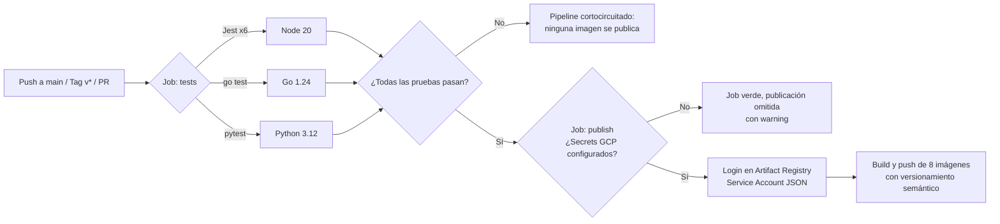

# Pipeline CI/CD — GitHub Actions + GCP Artifact Registry

> Práctica 5 — Software Avanzado, 2do Semestre 2026

## 1. Descripción general

El repositorio cuenta con dos workflows en `.github/workflows/`:

| Workflow | Archivo | Disparadores | Función |
|---|---|---|---|
| Pruebas unitarias | `unit-tests.yml` | push/PR a `main`, `develop` | Ejecuta las suites de pruebas de los 8 servicios. |
| CI/CD completo | `ci-cd.yml` | push a `main`, tags `v*`, PR a `main`, manual | Pruebas → build → publicación de imágenes en el Registry. |

### Flujo del pipeline CI/CD



**Requisito de cortocircuito:** el job `publish` depende de `tests` (`needs: tests`), por lo que si **una sola prueba falla**, la construcción y publicación de imágenes no se ejecuta. Además, la estrategia `fail-fast: true` detiene la matriz al primer fallo.

## 2. Imágenes publicadas

Las 8 imágenes se publican en:

```
<REGION>-docker.pkg.dev/<GCP_PROJECT_ID>/<GCP_ARTIFACT_REGISTRY_REPOSITORY>/<servicio>
```

| Servicio | Contexto de build | Dockerfile |
|---|---|---|
| `frontend` | `Frontend/` | `Frontend/Dockerfile` |
| `api-gateway` | `Backend/` | `Backend/api-gateway/Dockerfile` |
| `auth-service` | `Backend/` | `Backend/services/auth-service/Dockerfile` |
| `catalog-service` | `Backend/` | `Backend/services/catalog-service/Dockerfile` |
| `inscripcion-service` | `Backend/` | `Backend/services/inscripcion-service/Dockerfile` |
| `notificaciones-service` | `Backend/` | `Backend/services/notificaciones-service/Dockerfile` |
| `reproduccion-service` | `Backend/services/reproduccion-service/` | `Dockerfile` |
| `analitica-service` | `Backend/services/analitica-service/` | `Dockerfile` |

> **Nota:** los servicios TypeScript se compilan con el contexto `Backend/` porque sus Dockerfiles copian los contratos compartidos de `Backend/proto/`.

## 3. Estrategia de etiquetado (versionamiento semántico)

Implementado con `docker/metadata-action@v5`:

| Evento | Etiquetas generadas por servicio |
|---|---|
| Tag de Git `v1.2.0` | `<servicio>:1.2.0` y `<servicio>:latest` |
| Push a `main` | `<servicio>:main` y `<servicio>:sha-<hash-corto>` |

Esto cumple el requisito de la práctica `<nombre_del_servicio>:<Tag_de_la_rama_release>` y el entregable de crear el tag **V1.2.0** en el repositorio:

```bash
git tag v1.2.0
git push origin v1.2.0
```

## 4. Repository Secrets requeridos

La práctica exige el uso de **Repository Secrets** para las credenciales del Registry
(`Settings → Secrets and variables → Actions → New repository secret`):

| Secret | Descripción | Ejemplo |
|---|---|---|
| `GCP_PROJECT_ID` | ID del proyecto de Google Cloud | `yousac-123456` |
| `GCP_ARTIFACT_REGISTRY_REGION` | Región del repositorio de Artifact Registry | `us-central1` |
| `GCP_ARTIFACT_REGISTRY_REPOSITORY` | Nombre del repositorio de Artifact Registry | `yousac` |
| `GCP_SA_KEY` | JSON completo de la llave de la Service Account | `{"type": "service_account", ...}` |

> **Modo degradado:** mientras los secrets no estén configurados, el job `publish`
> detecta su ausencia y termina **con éxito sin publicar** (emite un `::warning::`).
> Así el pipeline queda listo y no falla en verde antes de tener las credenciales.

La autenticación contra Artifact Registry usa el patrón oficial de GCP con
`docker/login-action`: usuario `_json_key` y la llave JSON de la Service Account
(`GCP_SA_KEY`) como password. No se generan ni dependen de access tokens.

## 5. Configuración en GCP (cuando haya credenciales)

### 5.0 Guía con la Consola Web (console.cloud.google.com)

**1. Obtener el Project ID (`GCP_PROJECT_ID`)**
- Barra superior → selector de proyectos → seleccionar el proyecto.
- Copiar el **Project ID** exacto (no el nombre ni el número del proyecto).

**2. Habilitar la API de Artifact Registry**
- Menú ☰ → *APIs & Services → Library* → buscar "Artifact Registry API" → **Enable**.

**3. Crear el repositorio de imágenes** (genera los valores de región y nombre)
- Menú ☰ → *Artifact Registry → Repositories → + CREATE*.
- Name: `yousac` · Format: **Docker** · Location type: **Region** · Región: `us-central1`.
- La región y el nombre elegidos son los valores de `GCP_ARTIFACT_REGISTRY_REGION`
  y `GCP_ARTIFACT_REGISTRY_REPOSITORY`.

**4. Crear la Service Account y generar la llave** (`GCP_SA_KEY`)
- Menú ☰ → *IAM & Admin → Service Accounts → + CREATE SERVICE ACCOUNT*.
- Nombre: `github-actions-registry`.
- Rol: *Artifact Registry → Artifact Registry Writer* (permite subir imágenes, no leer secretos ni administrar el proyecto).
- Abrir la SA → pestaña **KEYS → ADD KEY → Create new key → JSON → Create**.
- Se descarga un archivo `.json` cuyo contenido completo es el valor de `GCP_SA_KEY`.

> ⚠️ La llave JSON equivale a una contraseña: nunca se sube al repositorio ni se
> comparte; solo se pega en el Repository Secret de GitHub.

**5. Cargar los secrets en GitHub**
- Repo → *Settings → Secrets and variables → Actions → New repository secret*.
- Crear los 4 secrets con los nombres exactos de la tabla de la sección 4.

**6. Verificar el pipeline**
- Pestaña *Actions* → workflow "CI/CD — Pruebas y publicación de imágenes" → **Run workflow**.
- Al finalizar, en *Artifact Registry → `yousac`* deben listarse las 8 imágenes con sus etiquetas.

### 5.1 Crear el repositorio de Artifact Registry (gcloud)

```bash
gcloud artifacts repositories create yousac \
  --repository-format=docker \
  --location=us-central1 \
  --project=<GCP_PROJECT_ID>
```

### 5.2 Crear la Service Account para el pipeline

```bash
# Crear la cuenta de servicio
gcloud iam service-accounts create github-actions-registry \
  --display-name="GitHub Actions - Artifact Registry" \
  --project=<GCP_PROJECT_ID>

# Otorgar permiso de escritura en Artifact Registry
gcloud projects add-iam-policy-binding <GCP_PROJECT_ID> \
  --member="serviceAccount:github-actions-registry@<GCP_PROJECT_ID>.iam.gserviceaccount.com" \
  --role="roles/artifactregistry.writer"

# Generar la llave JSON (contenido del secret GCP_SA_KEY)
gcloud iam service-accounts keys create sa-key.json \
  --iam-account=github-actions-registry@<GCP_PROJECT_ID>.iam.gserviceaccount.com
```

### 5.3 Cargar los secrets

```bash
gh secret set GCP_PROJECT_ID --body "<GCP_PROJECT_ID>"
gh secret set GCP_ARTIFACT_REGISTRY_REGION --body "us-central1"
gh secret set GCP_ARTIFACT_REGISTRY_REPOSITORY --body "yousac"
gh secret set GCP_SA_KEY < sa-key.json
```

> **Seguridad:** la llave `sa-key.json` nunca se sube al repositorio. La publicación
> de imágenes es **100 % automática** desde el pipeline (prohibida la subida manual
> según los requisitos de la práctica).

## 6. Verificación local

Validar la sintaxis de los workflows (requiere [`actionlint`](https://github.com/rhysd/actionlint)):

```bash
actionlint .github/workflows/ci-cd.yml
```

Probar el build de una imagen con el mismo contexto que usa el pipeline:

```bash
docker build -f api-gateway/Dockerfile -t api-gateway:ci ./Backend
```

## 7. Evidencias para el Informe Técnico

1. Ejecución del workflow `ci-cd.yml` en verde (pestaña *Actions* de GitHub).
2. Resumen generado por el pipeline (`GITHUB_STEP_SUMMARY`) con las etiquetas de cada imagen.
3. Enlace al perfil del repositorio en Artifact Registry con las imágenes versionadas.
4. Captura de un pull request donde las pruebas bloquean la publicación.
