# Informe Técnico y Matriz SOLID — YoUSAC (Práctica 2)

Proyecto: YoUSAC · Práctica: 2 · Carné: 202307691 · Curso: Software Avanzado · Semestre: 2.º 2026 · Fecha: Agosto 2026

---

## Índice

1. [Introducción](#1-introducciónb)
2. [Arquitectura implementada](#2-arquitectura-implementada)
   - 2.0 [Visión general de la arquitectura](#20-visión-general-de-la-arquitectura)
   - 2.1 [Malla poliglota y backend](#21-malla-poliglota-y-backend)
   - 2.2 [API Gateway (punto de entrada único)](#22-api-gateway-punto-de-entrada-único)
   - 2.3 [Frontend WEB](#23-frontend-web)
   - 2.4 [Contratos gRPC (.proto)](#24-contratos-grpc-proto)
   - 2.5 [Persistencia con objetos programables base](#25-persistencia-con-objetos-programables-base)
   - 2.6 [Orquestación local (Docker Compose)](#26-orquestación-local-docker-compose)
3. [Evidencias de pruebas — Práctica 3](#3-evidencias-de-pruebas--práctica-3)
   - 3.1 [Panel Web Administrativo y Control RBAC](#31-panel-web-administrativo-y-control-rbac)
   - 3.2 [Ingesta masiva mediante CSV](#32-ingesta-masiva-mediante-csv)
   - 3.3 [Comprobación de registros en BD mediante SPs](#33-comprobación-de-registros-en-bd-mediante-sps)
   - 3.4 [Paginación desde el servidor (máximo 10 por página)](#34-paginación-desde-el-servidor-máximo-10-por-página)
4. [Matriz SOLID](#4-matriz-solid)
   - 4.0 [Matriz resumen general de SOLID en el proyecto](#40-matriz-resumen-general-de-solid-en-el-proyecto)
   - 4.1 [Principio de Responsabilidad Única (SRP)](#41-principio-de-responsabilidad-única-srp)
   - 4.2 [Principio Abierto/Cerrado (OCP)](#42-principio-abiertocerrado-ocp)
   - 4.3 [Principio de Sustitución de Liskov (LSP)](#43-principio-de-sustitución-de-liskov-lsp)
   - 4.4 [Principio de Segregación de Interfaces (ISP)](#44-principio-de-segregación-de-interfaces-isp)
   - 4.5 [Principio de Inversión de Dependencias (DIP)](#45-principio-de-inversión-de-dependencias-dip)
5. [Conclusiones](#5-conclusiones)

---

## 1. Introducción

Tras la fase de planificación y diseño de la Práctica 1, la Práctica 2 traslada la arquitectura propuesta a una implementación web funcional en entorno local. Se construyó la malla de microservicios con los tres lenguajes backend obligatorios (Go, TypeScript y Python) interconectados de forma síncrona mediante gRPC, con un API Gateway como punto de entrada único, acceso restringido a correos institucionales de la Facultad de Ingeniería y orquestación completa mediante Docker Compose.

Este documento detalla la arquitectura realmente implementada, el desarrollo de todos los diagramas de la práctica, la matriz SOLID que justifica la aplicación de los 5 principios de código limpio en el backend, y la evidencia de verificación e integración.

---

## 2. Arquitectura implementada


### 2.1 Malla poliglota y backend

El backend se compone de cinco microservicios, cada uno con su propia base de datos PostgreSQL independiente, su propio `Dockerfile` y su propio puerto gRPC. Todos se comunican internamente únicamente mediante gRPC (prohibido REST interno):

| Microservicio | Lenguaje | Responsabilidad | BD propia |
|---|---|---|---|
| `auth-service` | TypeScript (Node + Express + gRPC) | Identidades, roles, sesiones, JWT, OAuth institucional | `auth-db` (5432) |
| `catalog-service` | TypeScript (Node + Express + gRPC) | Catálogo, búsqueda, detalle de clases | `catalog-db` (5433) |
| `reproduccion-service` | Go (gRPC) | Reproducción, marcas de tiempo, checkpoints, calificaciones | `reproduccion-db` (5434) |
| `analitica-service` | Python (gRPC) | Analítica base, tendencias, recomendaciones, CSV | `analitica-db` (5435) |
| `inscripcion-service` | TypeScript (Node + gRPC) | Inscripción de estudiantes, registro de docentes/auxiliares y asignaciones catedrático/auxiliar | `inscripcion-db` (5436) |

Cada microservicio sigue una arquitectura hexagonal (puertos y adaptadores):

- `domain/` — entidades y reglas de negocio puras (sin dependencias externas).
- `application/ports/` — interfaces que el caso de uso necesita (repositorios, servicios de token, etc.).
- `application/services/` — casos de uso que dependen de las interfaces (DIP).
- `infrastructure/` — adaptadores concretos (PostgreSQL, Redis, bcrypt, JWT, proveedor OAuth mock).
- `interfaces/` — adaptadores de entrada (servidor gRPC, rutas HTTP internas, middlewares).
- `container.ts` / `main.go` / `container.py` — composition root que inyecta las dependencias.

### 2.2 API Gateway (punto de entrada único)

El API Gateway (`Backend/api-gateway`, TypeScript + Express, puerto 8080) es el único punto de contacto del cliente web (north-south). Responsabilidades:

- Restricción por dominio institucional (`middleware/domain-guard.ts`): bloquea correos fuera de `@ing.usac.edu.gt` / `@ingenieria.usac.edu.gt`.
- Validación de tokens JWT (`middleware/authenticate.ts`) y autorización por rol (`middleware/requireRole.ts`: `requireRole`, `requireAnyRole`).
- Mapeo de errores de dominio a respuestas HTTP (`middleware/error-handler.ts` + `domain/domain-error.ts`).
- Traducción HTTP → gRPC: cada ruta llama a su cliente gRPC (`grpc/auth-client.ts`, `grpc/catalog-client.ts`, `grpc/reproduction-client.ts`, `grpc/analitica-client.ts`).
- Servidor IdP institucional (`mock-idp.ts`): implementa el flujo OAuth 2.0 Authorization Code (`/auth/oauth/authorize` y `/auth/oauth/callback`). A diferencia de un IdP de demostración, valida de verdad las credenciales contra el directorio del auth-service (el usuario debe existir y la contraseña debe coincidir, verificado con bcrypt vía el RPC gRPC `ValidateCredentials`), deriva los roles del directorio (no del cliente) y rechaza correos fuera de los dominios institucionales, el mismo comportamiento de un IdP real (Google Workspace / Entra ID).
- Detección automática de duración de video: al subir un MP4 (`POST /catalog/classes/:claseId/video`) el gateway ejecuta `ffprobe` sobre los metadatos del archivo y actualiza la `duracion` real de la clase (RPC `ActualizarDuracion`), sobrescribiendo la duración manual. El archivo se escribe primero a un temporal y solo se reemplaza si es un video legible, por lo que una subida inválida devuelve `400` sin destruir el video anterior.
- Emisión de session cookie HttpOnly + Secure y JWT (`utils/cookies.ts`).

### 2.3 Frontend WEB

Frontend (React 18 + TypeScript + Vite 5, puerto 8081, nginx). El cliente solo habla con el API Gateway vía proxy `/api/* → api-gateway:8080`. Módulos implementados:

- Login/Registro: `LoginPage` (correo institucional + botón OAuth), `RegisterPage` con selector de rol Estudiante/Docente, `OAuthCallbackPage` (valida estado CSRF e intercambia el `code`).
- Catálogo y Reproductor: búsqueda, filtros, ficha de clase, reproductor con checkpoint.
- Sesión: `AuthContext` con JWT en `localStorage`, persistencia del estado.
- Layout por rol: `AppLayout` con sidebar colapsable (estilo YouTube), navegación que cambia según rol (Estudiante/Catedrático/Admin).
- Panel Admin (`/admin`): dashboard con estadísticas y acceso a gestión de usuarios/contenido (según mockup M6), protegido con `RequireRole('ROLE_ADMIN')`.

### 2.4 Contratos gRPC (.proto)

gRPC es un protocolo de comunicación síncrona entre microservicios basado en HTTP/2. A diferencia de REST, donde cada servicio define su API de manera ad hoc, gRPC exige definir primero un contrato formal: un archivo .proto (Protocol Buffers) que declara los mensajes y las operaciones (RPCs) de cada servicio de forma independiente del lenguaje. A partir de ese contrato se genera automáticamente el código de cliente y de servidor en el lenguaje de cada microservicio, de modo que todos hablan el mismo "idioma" sin importar si están escritos en TypeScript, Go o Python.

En este proyecto los contratos se concentran en una sola carpeta compartida (`Backend/proto/`), uno por dominio de microservicio:

| Contrato | Dominio |
|---|---|
| `auth.proto` | Identidades, sesiones, roles, OAuth |
| `catalogo.proto` | Catálogo, búsqueda y clases |
| `reproduccion.proto` | Checkpoints, historial y calificaciones |
| `analitica.proto` | Métricas, tendencias y recomendaciones |
| `inscripcion.proto` | Inscripciones y asignaciones |

Cada microservicio expone un servidor gRPC con las operaciones de su contrato, y el API Gateway actúa como único punto de entrada HTTP. El flujo es siempre el mismo: el navegador habla REST con el gateway y este traduce cada petición a una llamada gRPC hacia el microservicio correspondiente. De esa manera, todo el tráfico interno (este-oeste) es exclusivamente gRPC y el cliente web nunca se comunica directamente con un microservicio.

### 2.5 Persistencia con objetos programables base

Scripts SQL en `Backend/sql/`, sin ORMs abstractos (prohibidos Prisma/Supabase/BaaS); acceso con SQL directo desde los adaptadores de persistencia:

| Script | Tablas | Objetos programables |
|---|---|---|
| `auth.sql` | rol, usuario, usuario_rol, sesion, auditoria, permiso_rbac, token_verificacion | 6 SP · 5 funciones · 2 vistas · 3 triggers |
| `catalogo.sql` | (curso, clase, semestre, escuela, docente, …) | 4 SP · 3 funciones · 2 vistas · 1 trigger |
| `reproduccion.sql` | checkpoints, historial, calificaciones | SP, funciones, vistas, triggers |
| `analitica.sql` | (vistas, metricas, tendencias, …) | 6 SP · 7 funciones · 2 vistas · 3 triggers |
| `inscripcion.sql` | curso, docente, auxiliar, asignacion_docente, asignacion_auxiliar, asignacion_curso, auditoria_inscripcion | 3 SP · 3 funciones · 2 vistas · 2 triggers |
| `notificaciones.sql` | (planificado en el DER, fuera del alcance implementado) | — |

### 2.6 Orquestación local (Docker Compose)

- `docker-compose.yml` — entorno principal: `auth-db`, `catalog-db`, `reproduccion-db`, `analitica-db`, `inscripcion-db`, los 5 microservicios, `api-gateway` (8080) y `web` (8081), con volúmenes, `healthcheck` y red de Docker propia.
- `docker-compose.local.yml` — entorno local de la malla completa; el sistema se levanta con un único comando:

```bash
docker compose -f docker-compose.local.yml up --build -d
```

Cada servicio define sus variables por entorno (`.env.example`), incluidas las del flujo OAuth (`OAUTH_MOCK_ENABLED`, `OAUTH_MOCK_ISSUER`, `OAUTH_REDIRECT_URI`, `OAUTH_ISSUER_PUBLIC`, `OAUTH_CLIENT_ID`).

---

## 3. Evidencias de pruebas — Práctica 3

### 3.1 Panel Web Administrativo y Control RBAC
Al iniciar se ve asi, dashboard en un futuro tendrá toda la parte analitica.

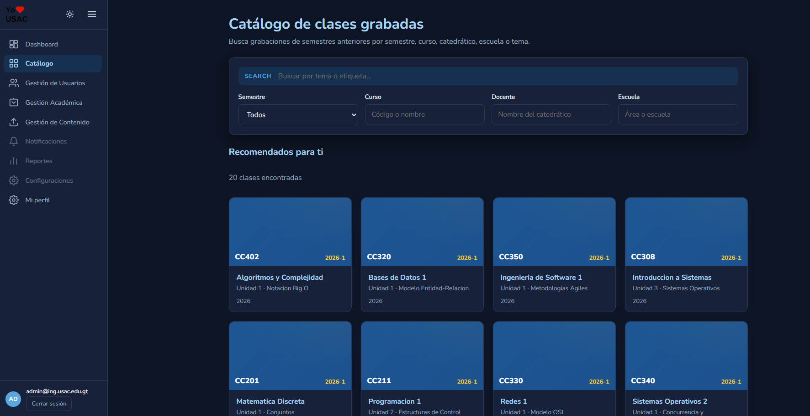

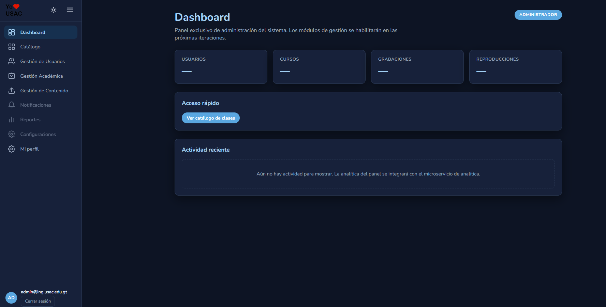

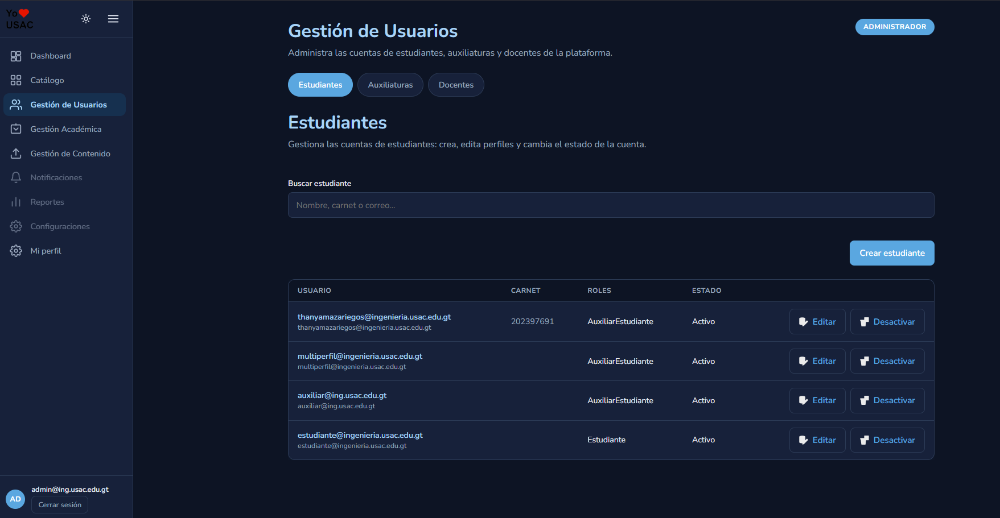

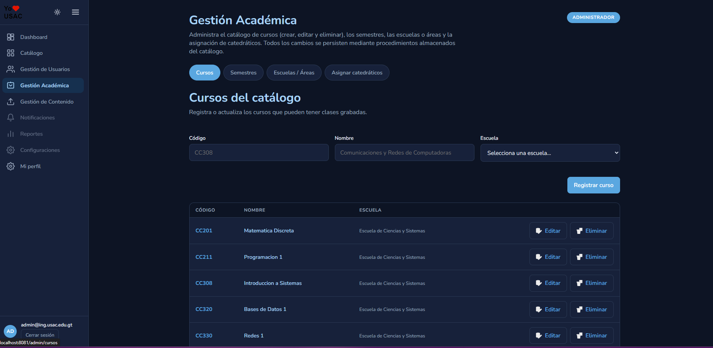

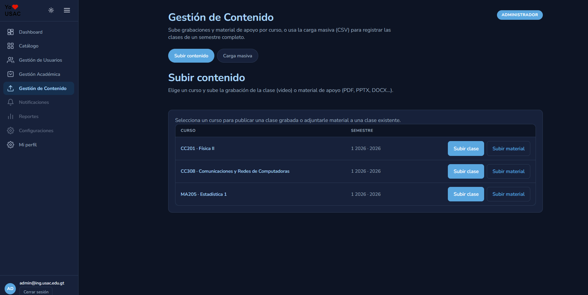
### 3.2 Ingesta masiva mediante CSV
Desde el Endpoint:`POST /api/admin/catalogo/csv`,exclusivo para los roles ADMIN/CATEDRATICO/AUXILIAR.

Catalogo vacio sin ingesta masiva
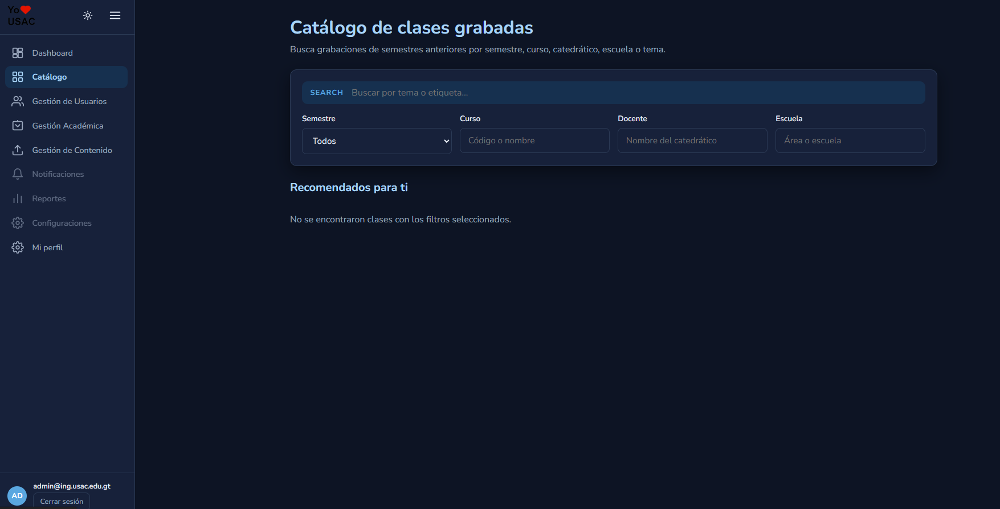

Carga exitosa de 20 clases
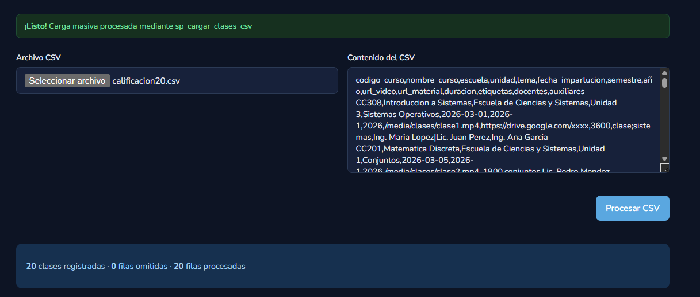

Catalogo con las clases cargadas y paginacion
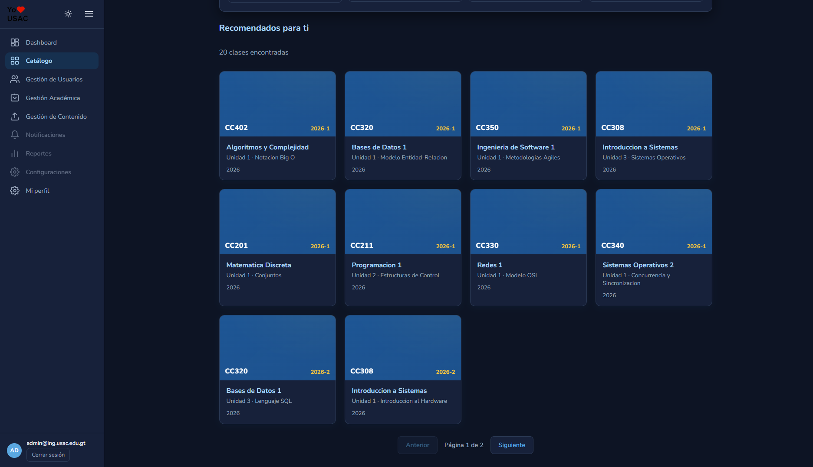

### 3.3 Comprobación de registros en BD mediante SPs
Procedimiento almacenado encargado de la carga masiva
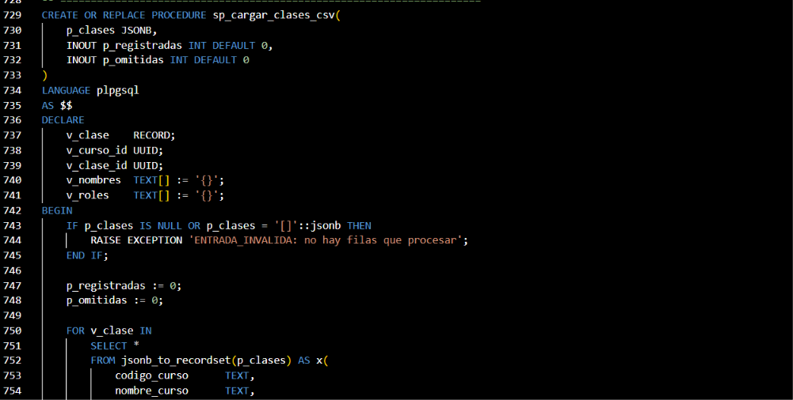

```powershell
docker exec yousac-catalog-db psql -U yousac -d yousac_catalogo -c "SELECT cc.codigo, cc.nombre, cg.tema, cg.semestre, cg.año, cg.url_video FROM clase_grabada cg JOIN curso_catalogo cc ON cc.id=cg.curso_id ORDER BY cg.año DESC;"
```

Ingresadas por medio de carga masiva
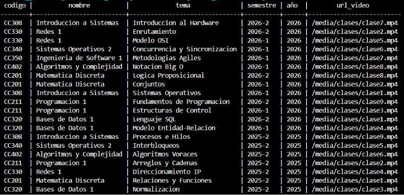


### 3.4 Paginación desde el servidor (máximo 10 por página)
En la base de datos se agrego en la función de buscar clase un limite de paginas
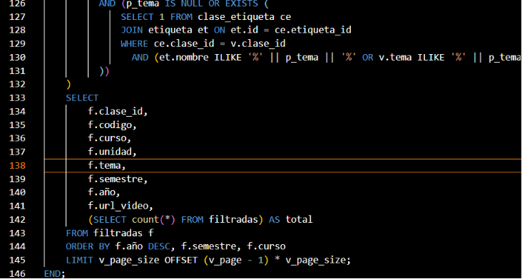

Paginación solo muestra 10


Aplicando filtros
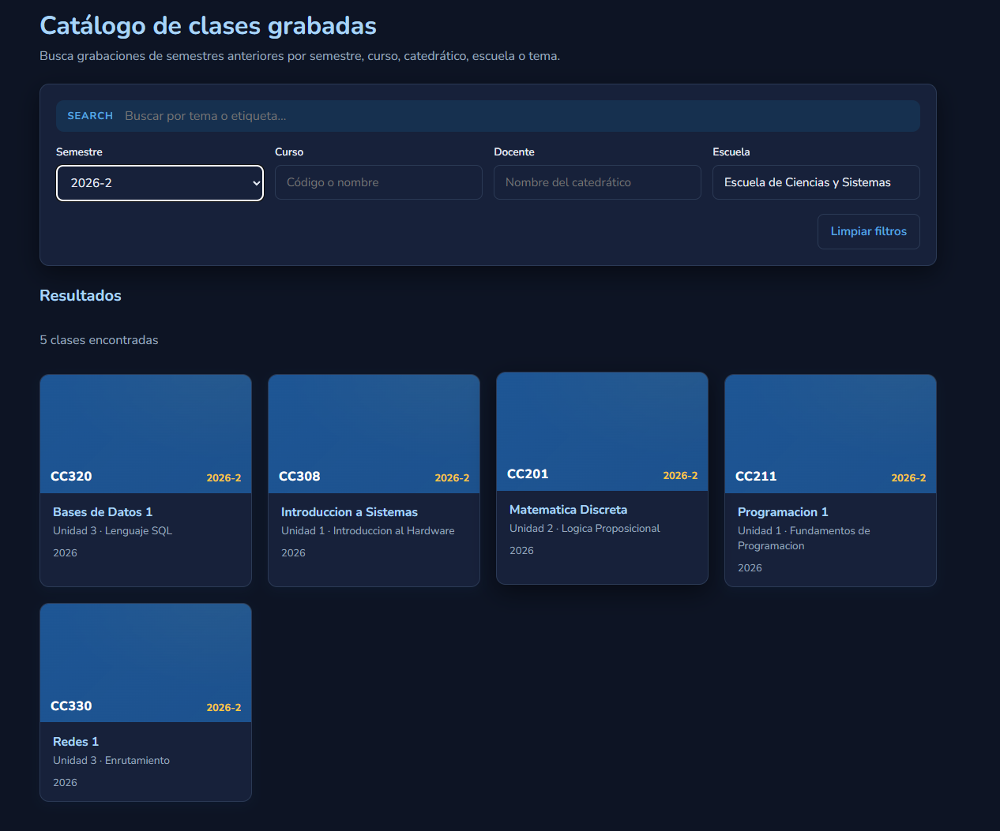

---

## 4. Matriz SOLID

SOLID es un acrónimo de cinco principios de diseño orientado a objetos propuestos por Robert C. Martin: Single Responsibility (responsabilidad única), Open/Closed (abierto/cerrado), Liskov Substitution (sustitución de Liskov), Interface Segregation (segregación de interfaces) y Dependency Inversion (inversión de dependencias). Su objetivo es producir código con bajo acoplamiento y alta cohesión, de modo que cada pieza tenga una razón clara de existir, sea sustituible, extensible y fácil de probar.

En este proyecto los cinco principios se aplican de forma transversal mediante una arquitectura hexagonal (puertos y adaptadores) repetida de forma consistente en los tres lenguajes del backend (TypeScript, Go y Python): cada microservicio separa su dominio de su aplicación, de su infraestructura y de sus interfaces; los casos de uso dependen de interfaces (puertos) y no de implementaciones concretas; y los adaptadores (PostgreSQL, Redis, JWT, bcrypt, OAuth, gRPC) se inyectan desde un composition root al arrancar cada proceso. El resultado es que el API Gateway y los microservicios pueden evolucionar, probarse y sustituir sus dependencias sin reescribir la lógica de negocio.

A continuación se detalla, por principio: su definición, la forma general en que se aplicó en el proyecto y la matriz de evidencias con su justificación en el código. Primero se presenta una matriz resumen general de los cinco principios, y luego cada principio se desarrolla con su detalle.

### 4.0 Matriz resumen general de SOLID en el proyecto

| Principio | Qué se aplicó (general) | Qué se consiguió |
|---|---|---|
| S — Responsabilidad Única | Cada componente tiene una sola razón de cambio: un microservicio por dominio, un servicio de aplicación por agregado y un middleware del gateway por preocupación. Ninguna clase mezcla reglas de negocio con infraestructura. | Se consiguieron componentes desacoplados y especializados: un servicio distinto por dominio (auth, catálogo, reproducción, analítica, inscripción), un servicio de aplicación por agregado y middlewares con un solo propósito. El código es fácil de entender y mantener porque para corregir o modificar un comportamiento solo se toca el componente que lo representa, sin revisar clases que mezclan varias responsabilidades. |
| O — Abierto/Cerrado | El sistema se extiende agregando código nuevo sin modificar el existente: los casos de uso dependen de puertos (interfaces) y los adaptadores o roles o RPCs nuevos se suman sin reescribir la lógica. | Se consiguió un sistema extensible: la persistencia es intercambiable (Postgres o memoria según `DATABASE_URL`), la autorización admite roles nuevos solo pasándolos como parámetro y el contrato gRPC acepta RPCs nuevos sin tocar los existentes. Agregar una tecnología o un rol no obliga a modificar lo que ya funciona, por lo que el sistema crece sin romper lo probado. |
| L — Sustitución de Liskov | Cualquier implementación de un puerto puede reemplazar a otra sin cambiar el comportamiento esperado por el caso de uso, en los tres lenguajes. | Se consiguieron implementaciones sustituibles: los adaptadores Postgres y memoria son equivalentes en auth, las interfaces implícitas de Go y los ABC de Python garantizan el mismo comportamiento en reproducción y analítica. Se puede cambiar la base de datos o un proveedor sin tocar la lógica de negocio ni alterar su resultado, lo que facilita el mantenimiento y las pruebas. |
| I — Segregación de Interfaces | Cada consumidor depende solo de interfaces pequeñas y específicas de su dominio; no hay contratos ni repositorios gigantes compartidos. | Se consiguieron contratos mínimos y cohesivos: un puerto por agregado (usuarios, sesiones, tokens), interfaces de entrada HTTP y gRPC separadas y un `.proto` por microservicio. Cada consumidor solo ve lo que usa, las dependencias entre módulos quedan claras y el código es fácil de entender sin cargar métodos o campos ajenos. |
| D — Inversión de Dependencias | La capa de aplicación depende de abstracciones definidas en `application/ports`, no de detalles de infraestructura; todo se inyecta desde un composition root. | Se consiguió una arquitectura desacoplada y testeable: la lógica de negocio no conoce Postgres, JWT ni Redis, todas las dependencias se inyectan desde un composition root (`container.ts`, `container.py`, `main.go`) y el gateway recibe los clientes gRPC por inyección. Los casos de uso se pueden probar con implementaciones simuladas y sustituir la infraestructura sin reescribirlos. |

Esta matriz resume, de forma general, qué principio se aplicó y qué se consiguió con ello. El detalle de cada fila (evidencia en el código, archivos y justificación detallada) se desarrolla en las matrices 4.1 a 4.5.

### 4.1 Principio de Responsabilidad Única (SRP)

Definición: una clase, módulo o función debe tener una sola razón para cambiar, es decir, debe hacerse cargo de una única responsabilidad del sistema. Si un componente responde a más de un actor o motivo de cambio, se dice que tiene más de una razón para cambiar y debe dividirse.

Aplicación en el proyecto: la responsabilidad única se aplica en dos niveles. A nivel de módulo, cada microservicio, cada capa hexagonal y cada middleware del gateway tiene un único propósito. A nivel de clase, los servicios de aplicación se dividen por agregado de dominio (auth, sesión, perfil, cuenta) y cada adaptador se ocupa de una sola tecnología (bcrypt solo hashea contraseñas, JWT solo firma tokens, el servidor gRPC solo traduce mensajes). Ninguna clase mezcla reglas de negocio con detalles de infraestructura.

| # | Evidencia en el código | Archivos | Justificación detallada |
|---|---|---|---|
| 1 | El API Gateway separa cada preocupación en un middleware independiente. | `api-gateway/src/middleware/authenticate.ts`, `requireRole.ts`, `domain-guard.ts`, `error-handler.ts`, `utils/cookies.ts` | Cada middleware atiende exactamente un aspecto de una petición HTTP: `authenticate.ts` valida el JWT y carga el contexto, `requireRole.ts` decide la autorización por rol, `domain-guard.ts` rechaza correos de dominios no institucionales, `error-handler.ts` mapea errores de dominio a códigos HTTP y `utils/cookies.ts` emite/limpia las cookies de sesión. Si mañana cambia la política de expiración de cookies, solo se toca `utils/cookies.ts`; si cambia el dominio permitido, solo `domain-guard.ts`. |
| 2 | Cada microservicio separa dominio, aplicación, infraestructura e interfaces en capas. | `auth-service/src/{domain,application,infrastructure,interfaces}` | `domain/` contiene entidades y reglas puras (sin dependencias externas), `application/` contiene los casos de uso y sus puertos, `infrastructure/` contiene los adaptadores de tecnología y `interfaces/` los puntos de entrada (HTTP y gRPC). La lógica de negocio, las entidades y los adaptadores cambian por motivos distintos, por lo que cada capa tiene una única razón de cambio. |
| 3 | Un servicio de aplicación por caso de uso/agregado. | `auth-service/src/application/services/auth.service.ts`, `session.service.ts`, `profile.service.ts`, `account.service.ts` | `AuthService` solo autentica (registro, login, logout, OAuth); `SessionService` solo administra el ciclo de vida de las sesiones; `ProfileService` solo gestiona perfiles y RBAC; `AccountService` solo gestiona verificación de correo y recuperación de contraseña. Esto evita la clase "todopoderosa" que mezcla responsabilidades y permite probar y modificar cada flujo de forma independiente. |
| 4 | El servidor gRPC solo traduce el contrato al servicio de aplicación. | `reproduccion-service/internal/interfaces/grpc/server.go`, `analitica-service/src/analitica/interfaces/grpc/server.py` | El adaptador de entrada gRPC valida el mensaje recibido, invoca el caso de uso correspondiente y devuelve la respuesta del contrato; no contiene reglas de negocio ni consultas SQL. Toda la lógica vive en la capa de aplicación, de modo que cambiar el transporte (p. ej. agregar REST) no altera el comportamiento del servicio. |
| 5 | Validación de dominio institucional aislada. | `auth-service/src/domain/services/email-domain-validator.ts`, `api-gateway/src/middleware/domain-guard.ts` | La regla de dominio institucional (`@ing.usac.edu.gt` / `@ingenieria.usac.edu.gt`) vive en una clase única y reutilizable: `EmailDomainValidator` se usa en el registro y login del auth-service, y `domain-guard` la aplica en el gateway. Si la política cambia, se modifica un solo punto y el resto del sistema la hereda. |


### 4.2 Principio Abierto/Cerrado (OCP)

Definición: las entidades de software deben estar abiertas para la extensión pero cerradas para la modificación. Es decir, se debe poder agregar comportamiento nuevo (nuevos adaptadores, nuevos roles, nuevos RPCs) sin reescribir el código que ya existe y funciona.

Aplicación en el proyecto: el patrón de puertos y adaptadores aplica OCP de forma directa. Los casos de uso dependen de interfaces; para agregar una nueva tecnología de persistencia, un nuevo proveedor OAuth o un nuevo mecanismo de contraseñas solo se crea una nueva clase que implemente la interfaz existente, sin tocar la lógica de negocio. En la capa de transporte, el contrato gRPC es versionable, por lo que agregar un RPC no rompe los existentes.

| # | Evidencia en el código | Archivos | Justificación detallada |
|---|---|---|---|
| 1 | Puertos (interfaces) con múltiples adaptadores intercambiables. | `auth-service/src/application/ports/user-repository.ts` implementado por `postgres-user-repository.ts` y `in-memory-user-repository.ts` | El puerto `UserRepository` declara el contrato de persistencia (save, findByEmail, findByRoles, etc.) y el container elige en tiempo de arranque entre la implementación Postgres o la de memoria según exista `DATABASE_URL`. Agregar un tercer adaptador (p. ej. Mongo) no requiere modificar ni el caso de uso ni los adaptadores existentes: el sistema queda abierto a extensión y cerrado a modificación. |
| 2 | Mismo patrón para repositorios de sesión y tokens de verificación. | `session-repository.ts` → `postgres-session-repository.ts`, `in-memory-session-repository.ts` | El mismo mecanismo de los usuarios se repite para sesiones y tokens de verificación: la lógica de negocio depende solo de la interfaz y los adaptadores concretos se intercambian desde el container. Cada nuevo adaptador se agrega sin tocar el código existente. |
| 3 | Nuevos roles se agregan sin modificar la autorización. | `api-gateway/src/middleware/requireRole.ts` (`requireAnyRole`) | `requireAnyRole(...roles)` recibe los roles permitidos como parámetros: si se agrega un rol nuevo (p. ej. `ROLE_COORDINADOR`) basta con usarlo al proteger la ruta, sin cambiar el middleware. La función `requireRole` incluso tolera ambos formatos de nombre de rol, lo que evita acoplar la autorización al mapeo concreto. |
| 4 | Nuevos RPCs se agregan extendiendo el contrato. | `Backend/proto/auth.proto`, `catalogo.proto`, `reproduccion.proto`, `analitica.proto` | Los contratos Protobuf son versionables y extensibles por diseño: agregar un RPC (p. ej. `ListUsersByRole`) se hace declarándolo en el servicio del `.proto` y añadiendo su handler, sin modificar los RPCs existentes ni el código de los clientes que ya los consumen. |
| 5 | Servicios de infraestructura intercambiables. | `infrastructure/auth/bcrypt-password-service.ts`, `jwt-token-service.ts`, `infrastructure/oauth/mock-oauth-provider.ts` | `BcryptPasswordService` y `JwtTokenService` implementan las interfaces `PasswordService` y `TokenService`; `MockOAuthProvider` implementa el contrato del proveedor OAuth. Sustituir el mock por un IdP real solo requiere crear un nuevo adaptador con la misma interfaz e inyectarlo en el container, sin modificar los casos de uso. |

### 4.3 Principio de Sustitución de Liskov (LSP)

Definición: si una clase `S` es subtipo de `T`, entonces los objetos de tipo `T` deben poder ser reemplazados por objetos de tipo `S` sin alterar la corrección del programa. En la práctica, cualquier implementación de una interfaz debe cumplir el contrato que el consumidor espera de ella.

Aplicación en el proyecto: todos los adaptadores de persistencia, caché y proveedores de identidad implementan fielmente la interfaz de su puerto y son intercambiables desde el composition root. Como el consumo se hace siempre a través de la abstracción, sustituir una implementación por otra (Postgres por memoria, mock por IdP real) no cambia el comportamiento esperado por los casos de uso. Esto se verifica también en la uniformidad de los errores de dominio y de los clientes gRPC.

| # | Evidencia en el código | Archivos | Justificación detallada |
|---|---|---|---|
| 1 | Todos los adaptadores de persistencia implementan la misma interfaz del puerto. | `auth-service/src/infrastructure/persistence/postgres/*.ts` y `memory/*.ts` implementan `application/ports/*.ts` | `PostgresUserRepository` y `InMemoryUserRepository` exponen exactamente los mismos métodos y devuelven las mismas entidades de dominio. El `AuthService` no sabe cuál está en uso, por lo que cualquiera de las dos puede sustituir a la otra sin alterar el resultado del flujo. |
| 2 | Mismo patrón en Go (interfaces implícitas). | `reproduccion-service/internal/application/ports/repository.go` y `internal/infrastructure/persistence/postgres/repository.go` | En Go la sustitución es estructural: la implementación Postgres cumple la interfaz `ReproduccionRepository` por el simple hecho de declarar los mismos métodos (`GuardarCheckpoint`, `ObtenerCheckpoint`, `HistorialReciente`, `RegistrarCalificacion`, `Ping`). El servicio de aplicación depende solo del puerto y cualquier implementación con esos métodos puede reemplazarla. |
| 3 | Mismo patrón en Python (ABC). | `analitica-service/src/analitica/application/ports/repository.py` y `infrastructure/persistence/postgres/repository.py` | Los puertos `AnaliticaRepository` y `CacheRepository` son ABC con `@abstractmethod`; los adaptadores Postgres y Redis heredan de ellos y están obligados a implementar cada método. Los casos de uso consumen la abstracción, de modo que el adaptador concreto es reemplazable por cualquier otro que cumpla el ABC. |
| 4 | Los errores de dominio se propagan uniformemente. | `api-gateway/src/domain/domain-error.ts`, `auth-service/src/domain/errors/domain-error.ts`, `analitica-service/src/analitica/domain/errors.py` | Todos los servicios modelan sus errores con el mismo tipo de dominio (código + mensaje + código HTTP/gRPC). Cualquier adaptador produce este mismo tipo de error, de modo que el `error-handler` del gateway los trata de forma idéntica y el cliente recibe siempre el mismo formato de respuesta. |
| 5 | Los clientes gRPC del gateway comparten el mismo contrato. | `api-gateway/src/grpc/*-client.ts` | Los clientes gRPC del gateway (auth, catalog, reproduccion, analitica, inscripcion) se construyen con la misma forma (paquete proto, servicio, llamada con metadata) y manejan los mismos códigos de error gRPC (p. ej. `NOT_FOUND`, `INVALID_ARGUMENT`). Cualquiera puede usarse en el servidor Express de la misma manera, manteniendo el comportamiento esperado. |

### 4.4 Principio de Segregación de Interfaces (ISP)

Definición: ningún cliente debe verse forzado a depender de métodos que no utiliza. Las interfaces grandes y genéricas deben dividirse en interfaces más pequeñas y específicas, de modo que cada consumidor solo conozca lo que realmente necesita.

Aplicación en el proyecto: los puertos de la capa de aplicación son pequeños y especializados por agregado de dominio (un repositorio de usuarios, otro de sesiones, otro de tokens), los middlewares del gateway exponen una única firma de Express y los contratos `.proto` están separados por microservicio. Ningún consumidor paga el costo de conocer métodos que no usa, ni de un contrato gigante compartido.

| # | Evidencia en el código | Archivos | Justificación detallada |
|---|---|---|---|
| 1 | Puertos pequeños y especializados en lugar de interfaces genéricas. | `auth-service/src/application/ports/user-repository.ts`, `session-repository.ts`, `verification-token-repository.ts`, `token-service.ts` | No existe un `Repository` único que lo haga todo: `UserRepository` solo modela usuarios, `SessionRepository` solo sesiones, `VerificationTokenRepository` solo tokens de verificación y `TokenService` separa `PasswordService` de la firma de JWT. El `AuthService` depende únicamente de las interfaces que usa (usuarios, sesión, contraseña, tokens y validador de dominio) y no conoce ni arrastra métodos ajenos. |
| 2 | Separación entre la interfaz de entrada HTTP y la de entrada gRPC. | `auth-service/src/interfaces/http/**` vs `auth-service/src/interfaces/grpc/server.ts` | El servicio expone dos adaptadores de entrada separados: uno HTTP (para desarrollo/verificación) y otro gRPC (el que usa la malla en producción). Quien consume gRPC no está obligado a conocer los endpoints HTTP y viceversa; cada interfaz muestra solo lo que su consumidor necesita. |
| 3 | Middlewares del gateway con un único método. | `api-gateway/src/middleware/*.ts` | Cada middleware de Express expone únicamente la firma `(req, res, next)`. No hay objetos `req` aumentados con docenas de utilidades: el contexto que se agrega (`req.context`) es un contrato mínimo y tipado con el usuario y los roles. |
| 4 | Puertos en Go mínimos por agregado. | `reproduccion-service/internal/application/ports/repository.go` | `ReproduccionRepository` declara solo las operaciones del agregado de reproducción (checkpoints, historial y calificaciones). El caso de uso de checkpoint no conoce ni arrastra métodos de catálogo ni de autenticación: la interfaz queda mínima y cohesiva. |
| 5 | Contratos `.proto` segregados por dominio. | `auth.proto`, `catalogo.proto`, `reproduccion.proto`, `analitica.proto` | Cada microservicio tiene su propio `.proto` en `Backend/proto/` con los mensajes y RPCs de su dominio. No existe un único `.proto` gigante compartido: cada servicio genera y consume únicamente el contrato de su dominio y no arrastra tipos que no le corresponden. |

### 4.5 Principio de Inversión de Dependencias (DIP)

Definición: los módulos de alto nivel no deben depender de los módulos de bajo nivel; ambos deben depender de abstracciones. Las abstracciones no deben depender de los detalles; los detalles deben depender de las abstracciones. La dirección de las dependencias se invierte respecto del flujo de ejecución.

Aplicación en el proyecto: la capa de aplicación (alto nivel) depende únicamente de interfaces definidas dentro de `application/ports/`; los adaptadores de infraestructura (bajo nivel: Postgres, Redis, JWT, bcrypt, OAuth) implementan esas interfaces y dependen de la aplicación, nunca al revés. La construcción y la inyección de todas las dependencias se centraliza en un composition root (`container.ts`, `container.py`, `main.go`) que decide en tiempo de arranque qué adaptador concreto se inyecta en cada caso de uso.

| # | Evidencia en el código | Archivos | Justificación detallada |
|---|---|---|---|
| 1 | Los módulos de alto nivel dependen de abstracciones, no de detalles. | `auth-service/src/application/services/auth.service.ts` depende de `application/ports/*`, no de `infrastructure/*` | El constructor de `AuthService` recibe `UserRepository`, `SessionService`, `PasswordService`, `TokenService` y `EmailDomainValidator`, todos tipos abstractos (interfaces). La clase no importa nada de Express, Postgres, bcrypt ni JWT: la política de negocio solo conoce contratos, por lo que los detalles de tecnología pueden cambiar sin tocar el caso de uso. |
| 2 | Composition root centraliza la inyección de dependencias. | `auth-service/src/container.ts`, `analitica-service/src/analitica/container.py`, `reproduccion-service/cmd/server/main.go` | Al arrancar cada proceso, el composition root construye los adaptadores concretos (Postgres o memoria, JWT, bcrypt, mock OAuth) y los inyecta en los servicios de aplicación. Ningún caso de uso construye sus dependencias internamente; todas llegan por inyección desde un único punto. |
| 3 | El gateway inyecta los clientes gRPC a las rutas. | `api-gateway/src/index.ts` + `server.ts` | El servidor Express no construye los clientes gRPC dentro de las rutas: se crean en el arranque (`index.ts`) y se pasan al `server.ts`, que los usa en cada handler. Esto permite probar el servidor con clientes simulados sin levantar la malla. |
| 4 | Flujo de dependencias en Go (interfaces definidas por el consumidor). | `reproduccion-service/internal/application/ports/repository.go` (definida en `application`), implementada en `infrastructure/persistence/postgres/repository.go` | La interfaz `ReproduccionRepository` se define en el paquete de aplicación (el consumidor), y el paquete de infraestructura la implementa importando la aplicación. La infraestructura depende de la aplicación y nunca al revés, cumpliendo la dirección de dependencias que pide DIP. |
| 5 | Flujo de dependencias en Python (ABC en `application`). | `analitica-service/src/analitica/application/ports/repository.py` + `container.py` | Los puertos son ABC declarados en `application/ports/`; los adaptadores de infraestructura (Postgres y Redis) los heredan, y `container.py` construye e inyecta las implementaciones en los casos de uso. La capa de aplicación no conoce ni Postgres ni Redis. |

---

## 5. Conclusiones

1. Se construyó una malla de microservicios poliglota (Go, TypeScript y Python) que se comunica estrictamente por gRPC, cumpliendo el desacoplamiento y la restricción de tráfico interno del enunciado; se añadió además el microservicio `inscripcion-service` (TypeScript) para la gestión de inscripciones y asignaciones.
2. El API Gateway funciona como punto de entrada único: valida tokens JWT, restringe el acceso a correos institucionales y traduce HTTP → gRPC, de modo que el frontend nunca habla directo con un microservicio.
3. Las sesiones seguras se implementan con JWT + session cookie `HttpOnly`/`Secure`, cubriendo la gestión de sesiones requerida.
4. La persistencia se realizó con BDs independientes por microservicio y objetos programables (procedimientos almacenados, vistas, funciones y triggers), sin ORMs abstractos ni herramientas BaaS.
5. La aplicación de los 5 principios SOLID quedó evidenciada en la matriz: el patrón de puertos y adaptadores aplicado de forma consistente en los tres lenguajes garantiza extensibilidad, sustituibilidad y bajo acoplamiento.
6. El sistema completo se orquesta localmente con Docker Compose mediante un único comando, y todas las rutas críticas fueron verificadas de extremo a extremo.
