# Informe Técnico — YoUSAC (Prácticas 5 y 6)

- **Proyecto:** YoUSAC
- **Práctica:** 5 — Fase 2
- **Anexo:** 6 — Pipeline de CD hacia servidor de desarrollo (VM)
- **GRUPO:** No.4
- **Curso:** Software Avanzado
- **Semestre:** 2.º semestre de 2026
- **Repositorio de código:** [thanya-gate/SA_PROYECTO_202307691](https://github.com/thanya-gate/SA_PROYECTO_202307691)

## Índice

- [Informe Técnico — YoUSAC (Prácticas 5 y 6)](#informe-técnico--yousac-prácticas-5-y-6)
  - [Índice](#índice)
  - [1. Introducción](#1-introducción)
  - [2. Objetivo, alcance y componentes](#2-objetivo-alcance-y-componentes)
  - [3. Evidencias del pipeline CI/CD](#3-evidencias-del-pipeline-cicd)
    - [3.1 Despliegue continuo hacia la VM](#31-despliegue-continuo-hacia-la-vm)
    - [3.2 Despliegue continuo hacia Kubernetes (GKE) en producción](#32-despliegue-continuo-hacia-kubernetes-gke-en-producción)
  - [4. Registry de imágenes](#4-registry-de-imágenes)
    - [Imágenes publicadas](#imágenes-publicadas)
  - [5. Funcionalidades de aprendizaje interactivo (Fase 2)](#5-funcionalidades-de-aprendizaje-interactivo-fase-2)
    - [5.1 Editor Markdown](#51-editor-markdown)
    - [5.2 Creación de un apunte](#52-creación-de-un-apunte)
    - [5.3 Pines y navegación temporal](#53-pines-y-navegación-temporal)
    - [5.4 Persistencia y aislamiento](#54-persistencia-y-aislamiento)
    - [5.5 Exportación](#55-exportación)
    - [5.6 Foro de dudas anclado al minuto exacto](#56-foro-de-dudas-anclado-al-minuto-exacto)
    - [5.7 Segmentación por capítulos y temas (Video Chapters)](#57-segmentación-por-capítulos-y-temas-video-chapters)
    - [5.8 Repositorio de material adjunto y recursos de laboratorio](#58-repositorio-de-material-adjunto-y-recursos-de-laboratorio)
    - [5.9 Playlists de repaso](#59-playlists-de-repaso)
  - [6. Pruebas unitarias](#6-pruebas-unitarias)

## 1. Introducción

Este informe documenta la implementación y verificación de las funcionalidades de aprendizaje interactivo de la Fase 2 de YoUSAC. Entre ellas se incluyen el cuaderno de apuntes (edición en Markdown, marcadores de tiempo y exportación), el foro de dudas anclado al minuto exacto del video, la segmentación de las grabaciones por capítulos temáticos, el repositorio de material adjunto y las playlists de repaso.

También se presentan las evidencias del pipeline de integración y entrega continua. El pipeline ejecuta las suites de pruebas del proyecto y, únicamente cuando estas finalizan correctamente, construye y publica las ocho imágenes Docker en Google Cloud Artifact Registry. Para la Práctica 6 se documenta además el despliegue automático de esas imágenes hacia la VM de desarrollo.

## 2. Objetivo, alcance y componentes

El objetivo del módulo es que cada estudiante disponga de un cuaderno persistente asociado a sus clases y al tiempo exacto de reproducción del contenido audiovisual.

La solución involucra los siguientes componentes:

- **Frontend:** presenta el editor `ApunteEditor`, la vista previa Markdown, los pines sobre la barra de reproducción y las opciones de exportación.
- **API Gateway:** autentica al usuario, aplica control de acceso y expone las operaciones HTTP para listar, crear, actualizar, eliminar y exportar apuntes.
- **Microservicio de reproducción:** implementa mediante gRPC las reglas del cuaderno, la validación de marcadores y la generación del archivo Markdown.
- **PostgreSQL:** persiste los apuntes por estudiante y clase. Las consultas y modificaciones utilizan la identidad autenticada para mantener aislada la información de cada estudiante.

## 3. Evidencias del pipeline CI/CD

El workflow se encuentra en [`.github/workflows/ci-cd.yml`](https://github.com/thanya-gate/SA_PROYECTO_202307691/blob/main/.github/workflows/ci-cd.yml). Su flujo está compuesto por tres etapas consecutivas:

1. Ejecución de pruebas unitarias para los servicios TypeScript, el frontend, el microservicio Go y el servicio Python.
2. Construcción y publicación de las ocho imágenes Docker. Esta etapa depende del éxito de todas las pruebas, por lo que una falla impide cualquier publicación en el Registry.
3. Conexión segura por SSH a la VM, descarga de las imágenes mediante Compose y actualización de los contenedores sin compilación en el servidor.

La ejecución de prueba del CD [V1.2.1 — GitHub Actions run 34423627304](https://github.com/thanya-gate/SA_PROYECTO_202307691/actions/runs/34423627304), disparada mediante un `push` del tag, presentó el siguiente resultado:

| Dato | Resultado |
|---|---|
| Estado | `Success` |
| Commit | `65463635c644dadd50f7b272e5052bd103f66099` |
| Referencia | `V1.2.1` |
| Trabajos de pruebas | 8 completados correctamente |
| Trabajos de publicación | 8 completados correctamente |
| Trabajo de despliegue | 1 completado correctamente |


La evidencia actual y el detalle de la etapa `deploy` se encuentran en el
enlace de la ejecución `V1.2.1`. La imagen anterior se conserva como evidencia
histórica de las etapas de pruebas y publicación.


### 3.1 Despliegue continuo hacia la VM

El tag Git `V1.2.1` se normalizó a la etiqueta de imágenes `1.2.1`. El job
`deploy` se conectó mediante SSH utilizando la host key fijada en
`VM_KNOWN_HOSTS`, sin copiar la configuración privada `.env.cloud`.

La VM utilizada fue `yousac-vm-nube`, en la zona `us-central1-a`, con borde
público en `http://136.119.139.125`. El despliegue ejecutó las siguientes
operaciones remotas:

```bash
docker compose --env-file /opt/yousac/.env.cloud \
  -f /opt/yousac/docker-compose.cloud.yml pull

docker compose --env-file /opt/yousac/.env.cloud \
  -f /opt/yousac/docker-compose.cloud.yml up -d --no-build --remove-orphans
```

Después del despliegue, los ocho servicios de aplicación quedaron activos con
imágenes `:1.2.1`. El Gateway, el frontend y el endpoint público `/api/health`
respondieron con HTTP 200. La VM no ejecutó `docker build`; únicamente consumió
imágenes de Artifact Registry.

Las pruebas ampliadas del cuaderno de apuntes, correspondientes al commit `c8c9c90`, también finalizaron correctamente en las ejecuciones [CI/CD #3](https://github.com/thanya-gate/SA_PROYECTO_202307691/actions/runs/33698438294) y [Pruebas unitarias #16](https://github.com/thanya-gate/SA_PROYECTO_202307691/actions/runs/33698438311).

### 3.2 Despliegue continuo hacia Kubernetes (GKE) en producción

La etapa de despliegue de producción aplica entrega continua hacia un clúster de Kubernetes en Google Kubernetes Engine (GKE). Se compone de dos trabajos encadenados que actúan como cortocircuito del CD:

1. **Preflight GKE producción** (solo lectura): autentica con Workload Identity Federation, obtiene las credenciales del clúster y ejecuta el script `deploy/gke-preflight.sh` para verificar que el clúster, el namespace, la IP estática y la conectividad con los servicios gestionados (Cloud SQL y Redis) estén disponibles antes de modificar cualquier recurso. Si este trabajo falla, se bloquea el despliegue.
2. **Deploy GKE producción**: recién cuando las pruebas, la publicación de imágenes, el preflight y la resolución de etiqueta concluyen correctamente, obtiene las credenciales del clúster y ejecuta `deploy/k8s-deploy.sh` con la etiqueta inmutable de la versión.

El script de despliegue aplica los manifiestos actualizados de Kubernetes mediante Kustomize, verifica la etiqueta de cada imagen, y espera el rollout de cada uno de los ocho `Deployment`s:

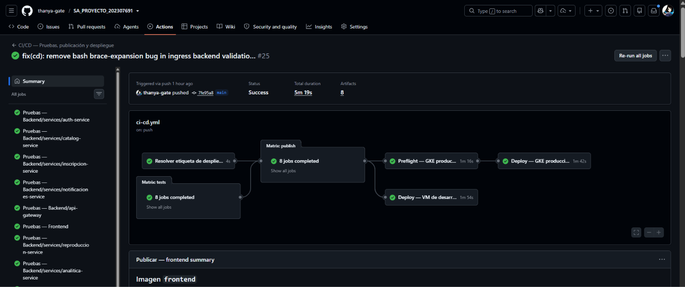

```bash
kubectl apply -k k8s/overlays/production

for deployment in frontend api-gateway auth-service catalog-service \
  reproduccion-service analitica-service inscripcion-service notificaciones-service; do
  kubectl rollout status "deployment/$deployment" --namespace yousac-prod --timeout=10m
done
```

Además del rollout de los ocho servicios, el pipeline espera que el `ManagedCertificate` quede en estado `Active` y valida que los backends del Ingress alcancen `HEALTHY` antes de confirmar el despliegue. Las reglas del gateway de entrada, la autenticación de los clústeres y la validación de la disponibilidad se resumen al final del trabajo.

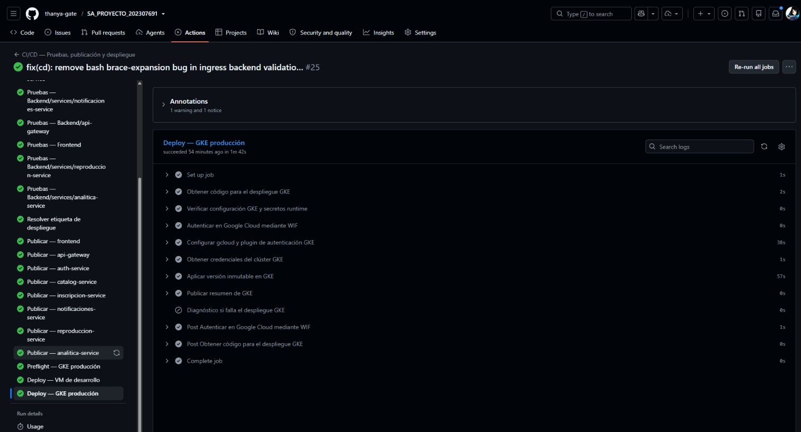


## 4. Registry de imágenes

Las imágenes se publicaron automáticamente en Google Cloud Artifact Registry. La configuración utilizada es la siguiente:

| Propiedad | Valor |
|---|---|
| Proveedor | Google Cloud Artifact Registry |
| Formato | Docker |
| Tipo | Estándar |
| Proyecto | `yousac-202300396-2026` |
| Región | `us-central1` |
| Repositorio | `yousac` |

**Enlace al repositorio:** [Artifact Registry — repositorio `yousac`](https://console.cloud.google.com/artifacts/docker/yousac-202300396-2026/us-central1/yousac?project=yousac-202300396-2026)

**Ruta base Docker:**

```text
us-central1-docker.pkg.dev/yousac-202300396-2026/yousac
```

### Imágenes publicadas

| Imagen | Ruta en Artifact Registry |
|---|---|
| `analitica-service` | [Abrir imagen](https://us-central1-docker.pkg.dev/yousac-202300396-2026/yousac/analitica-service) |
| `api-gateway` | [Abrir imagen](https://us-central1-docker.pkg.dev/yousac-202300396-2026/yousac/api-gateway) |
| `auth-service` | [Abrir imagen](https://us-central1-docker.pkg.dev/yousac-202300396-2026/yousac/auth-service) |
| `catalog-service` | [Abrir imagen](https://us-central1-docker.pkg.dev/yousac-202300396-2026/yousac/catalog-service) |
| `frontend` | [Abrir imagen](https://us-central1-docker.pkg.dev/yousac-202300396-2026/yousac/frontend) |
| `inscripcion-service` | [Abrir imagen](https://us-central1-docker.pkg.dev/yousac-202300396-2026/yousac/inscripcion-service) |
| `notificaciones-service` | [Abrir imagen](https://us-central1-docker.pkg.dev/yousac-202300396-2026/yousac/notificaciones-service) |
| `reproduccion-service` | [Abrir imagen](https://us-central1-docker.pkg.dev/yousac-202300396-2026/yousac/reproduccion-service) |


La prueba `V1.2.1` publicó las ocho imágenes con las etiquetas `1.2.1`,
`latest` y `sha-6546363`. El workflow también conserva las etiquetas de rama y
está preparado para generar etiquetas semánticas para la entrega `V1.3.0`.

Ejemplo para descargar la imagen del frontend:

```bash
docker pull us-central1-docker.pkg.dev/yousac-202300396-2026/yousac/frontend:1.2.1
```

El acceso al repositorio y a sus imágenes está sujeto a los permisos IAM configurados en el proyecto de Google Cloud.

## 5. Funcionalidades de aprendizaje interactivo 

### 5.1 Editor Markdown

El editor se abre en el panel lateral derecho del reproductor y permite escribir el título y contenido del apunte. Incluye una barra de formato y una vista previa para visualizar el resultado Markdown antes de guardarlo.


### 5.2 Creación de un apunte

Desde la barra de progreso se puede abrir un apunte nuevo en la posición seleccionada. El marcador se genera en formato `[MM:SS]` y queda relacionado con el segundo correspondiente del video.


### 5.3 Pines y navegación temporal

Cada apunte guardado se representa mediante un pin sobre la barra de progreso. Al interactuar con un pin se abre el apunte relacionado; al seleccionar un marcador desde la vista previa, el reproductor se desplaza al segundo exacto indicado.


### 5.4 Persistencia y aislamiento

El microservicio de reproducción almacena varios apuntes por clase y estudiante. Las operaciones de actualización y eliminación identifican tanto el apunte como al estudiante autenticado, evitando que un usuario modifique información perteneciente a otro usuario.

### 5.5 Exportación

El cuaderno puede exportarse como PDF desde el frontend y como archivo `.md` generado por el backend. La exportación Markdown reúne los apuntes persistidos de la clase y conserva los marcadores temporales.


### 5.6 Foro de dudas anclado al minuto exacto

El foro permite pausar el video y publicar una duda técnica vinculada directamente a la marca de tiempo actual de la reproducción. La pregunta queda registrada con su `posicionSegundos`, de modo que al reabrir el hilo se conoce el instante exacto en que surgió la consulta.

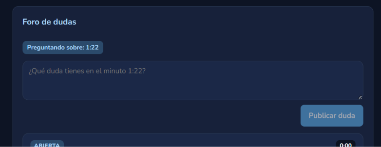

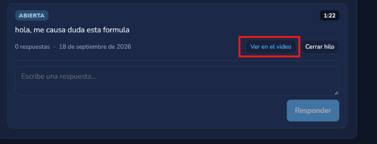

Los marcadores de duda se dibujan sobre la barra de progreso del reproductor y, al posicionar el cursor sobre uno de ellos, se previsualiza la pregunta sin interrumpir la reproducción. Desde la vista del foro, catedráticos, auxiliares y estudiantes pueden responder dentro del hilo; además, el autor de la pregunta o un catedrático/auxiliar pueden marcar una respuesta como verificada.

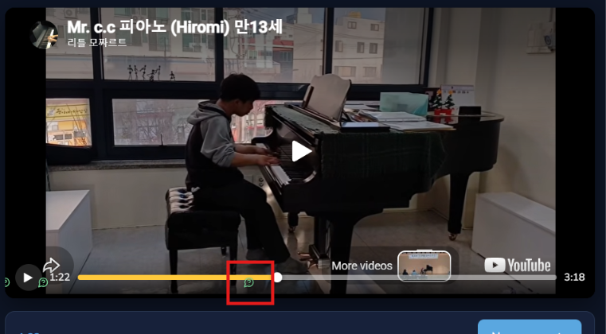

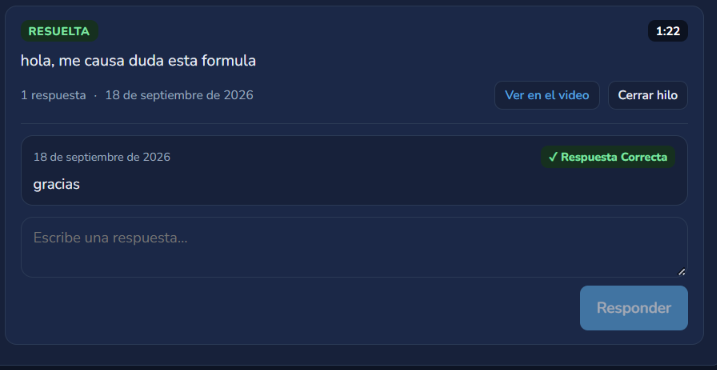

El API Gateway expone las operaciones `GET/POST /catalog/classes/:claseId/dudas` y `POST /catalog/dudas/:dudaId/respuestas`, respaldadas por el contrato gRPC del catálogo y las tablas `duda_clase` y `respuesta_duda`.

### 5.7 Segmentación por capítulos y temas

El catedrático o auxiliar dispone de un gestor dentro del panel de la clase para estructurar la grabación en bloques temáticos. Cada capítulo se define con un inicio y un fin expresados en segundos (por ejemplo, `00:00 - Introducción`, `12:30 - Fundamentos Teóricos`), respetando reglas de integridad: fin mayor que inicio, rango dentro de la duración y sin solapamientos entre capítulos.

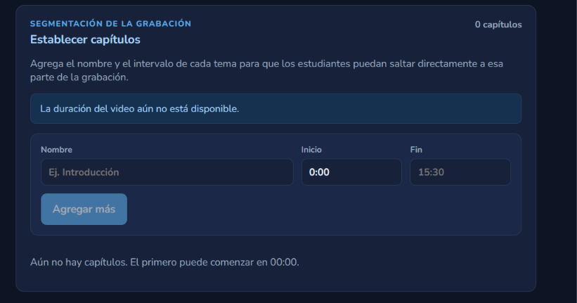

El reproductor segmenta visualmente la barra de avance según los capítulos definidos y muestra un índice lateral desplegable para navegar directamente al tema deseado. Al seleccionar un capítulo, la reproducción salta al inicio del bloque correspondiente.

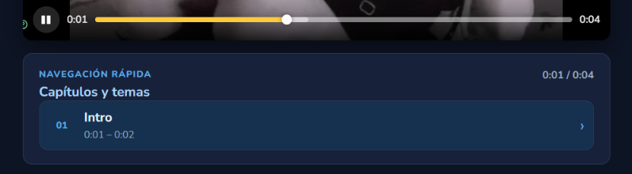

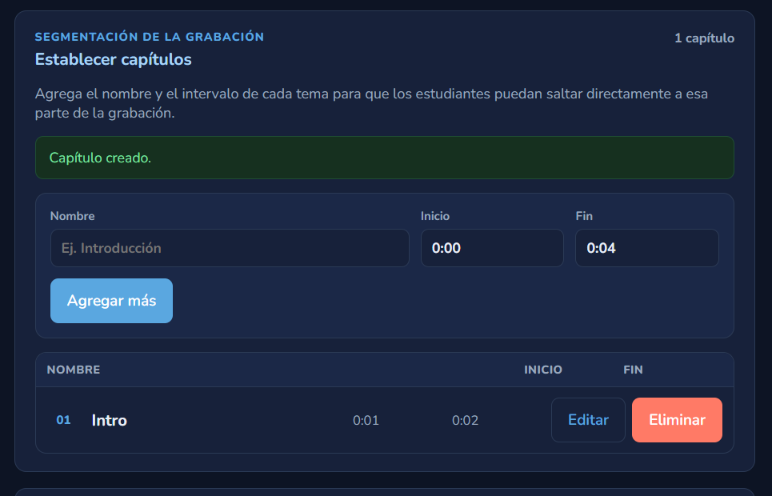

El componente `ChapterManager` implementa el CRUD y las operaciones se exponen mediante `GET/POST /catalog/classes/:claseId/chapters` en el API Gateway, con la tabla `capitulo` en PostgreSQL.

### 5.8 Repositorio de material adjunto y recursos de laboratorio

Cada clase cuenta con un repositorio de recursos didácticos en el que el catedrático y el auxiliar pueden subir, actualizar y versionar archivos como guías de laboratorio, presentaciones PDF, hojas de trabajo y código fuente. El sistema conserva la versión vigente de cada material lógico y mantiene el historial de versiones anteriores.

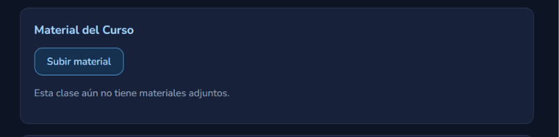

Las cargas se validan contra una lista permitida de tipos MIME y extensiones, se sanitiza el nombre del archivo y se limita el tamaño máximo a 50 MB, evitando la subida de archivos maliciosos o ejecutables no permitidos. El sistema registra el conteo de descargas de cada archivo para medir el uso de los recursos.

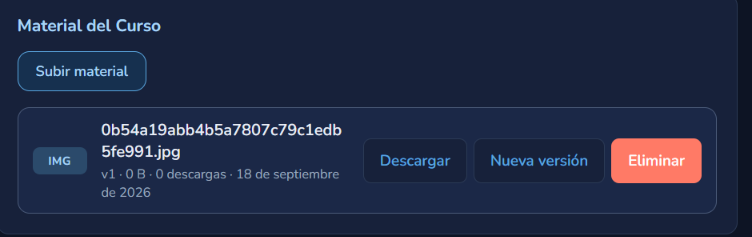

El API Gateway expone `GET/POST /catalog/classes/:claseId/materials` y la publicación de nuevas versiones, con la validación implementada en `validation/material.ts` y el almacenamiento versiónado en `storage.ts`.

### 5.9 Playlists de repaso

Los estudiantes pueden crear listas de reproducción personalizadas combinando grabaciones o fragmentos de distintos semestres y cursos. Cada playlist se identifica con un nombre y admite elementos ordenados, que pueden ser clases completas o fragmentos con un instante de inicio.

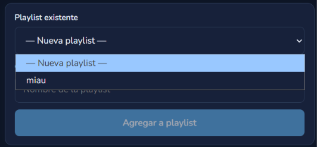

Las playlists se configuran como privadas (visibles solo para su propietario) o públicas, en cuyo caso el sistema genera un enlace único compartible no autenticado para que otros estudiantes accedan a la colección sin exponer las listas privadas. El detalle de una playlist permite reproducir sus elementos y reordenarlos.

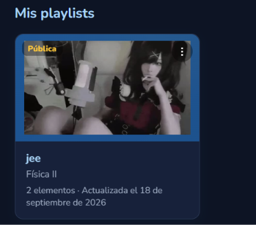

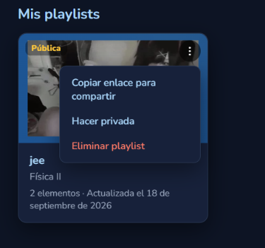

Las operaciones del API Gateway (`GET/POST /reproduccion/playlists`, `GET /reproduccion/playlists/publicas/:enlace`, entre otras) están respaldadas por el microservicio de reproducción (Go) y las tablas `playlist` y `playlist_item` de PostgreSQL.

## 6. Pruebas unitarias

Se incorporaron pruebas del cuaderno en las tres capas modificadas:

- **Frontend:** editor, formato Markdown, marcadores temporales, creación, actualización, eliminación, errores y exportación.
- **API Gateway:** autenticación, autorización, validación, aislamiento por estudiante, operaciones CRUD y descarga Markdown.
- **Microservicio de reproducción:** dominio, casos de uso, mapeo gRPC y persistencia PostgreSQL mediante dobles de prueba.

Las suites afectadas se ejecutaron localmente con los siguientes resultados:

| Componente | Resultado |
|---|---|
| API Gateway | 6 suites y 40 pruebas aprobadas |
| Frontend | 6 suites y 42 pruebas aprobadas |
| Microservicio de reproducción | `go test ./...` aprobado |

La instalación de dependencias, los comandos por módulo y la ejecución conjunta están documentados en [`Documentacion/TESTING.md`](TESTING.md).

## 7. Conclusiones

- El cuaderno de apuntes integra edición Markdown, persistencia por estudiante y clase, navegación mediante marcadores temporales y exportación en PDF y Markdown.
- Las pruebas automatizadas cubren la interacción del frontend, el contrato HTTP del API Gateway y las reglas de dominio y persistencia del microservicio de reproducción.
- El pipeline aplica el cortocircuito requerido: las imágenes solamente se construyen y publican cuando las ocho suites de la matriz concluyen correctamente.
- Google Cloud Artifact Registry contiene las ocho imágenes del sistema, identificadas por rama y por commit para mantener la trazabilidad de cada construcción.
- El despliegue continuo hacia la VM se verificó con el tag `V1.2.1`: la aplicación se actualizó mediante `docker compose pull` y `up -d --no-build`, sin compilar en el servidor.
