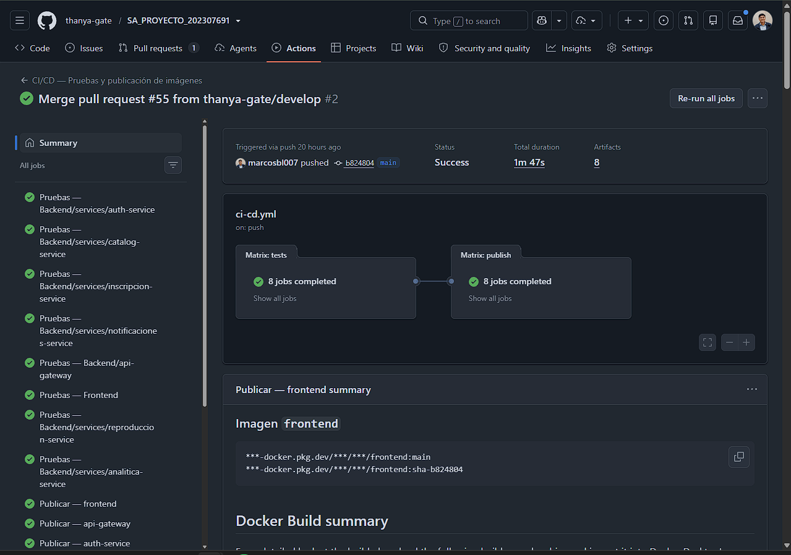
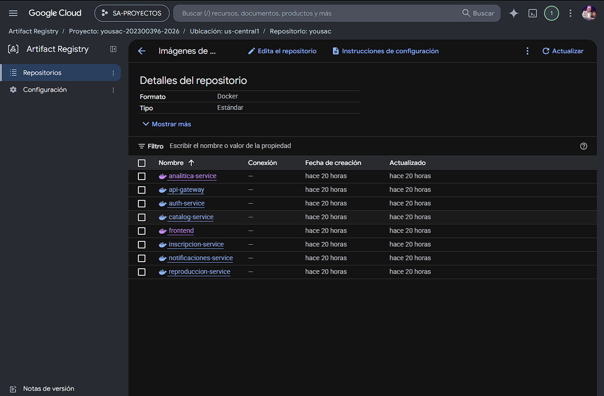

# Informe Técnico — YoUSAC (Prácticas 5 y 6)

- **Proyecto:** YoUSAC
- **Práctica:** 5 — Fase 2
- **Anexo:** 6 — Pipeline de CD hacia servidor de desarrollo (VM)
- **GRUPO:** No.4
- **Curso:** Software Avanzado
- **Semestre:** 2.º semestre de 2026
- **Repositorio de código:** [thanya-gate/SA_PROYECTO_202307691](https://github.com/thanya-gate/SA_PROYECTO_202307691)

## Índice

- [Informe Técnico — YoUSAC (Prácticas 5 y 6)](#informe-técnico--yousac-prácticas-5-y-6)
  - [Índice](#índice)
  - [1. Introducción](#1-introducción)
  - [2. Objetivo, alcance y componentes](#2-objetivo-alcance-y-componentes)
  - [3. Evidencias del pipeline CI/CD](#3-evidencias-del-pipeline-cicd)
    - [3.1 Despliegue continuo hacia la VM](#31-despliegue-continuo-hacia-la-vm)
  - [4. Registry de imágenes](#4-registry-de-imágenes)
    - [Imágenes publicadas](#imágenes-publicadas)
  - [5. Funcionalidad del cuaderno de apuntes](#5-funcionalidad-del-cuaderno-de-apuntes)
    - [5.1 Editor Markdown](#51-editor-markdown)
    - [5.2 Creación de un apunte](#52-creación-de-un-apunte)
    - [5.3 Pines y navegación temporal](#53-pines-y-navegación-temporal)
    - [5.4 Persistencia y aislamiento](#54-persistencia-y-aislamiento)
    - [5.5 Exportación](#55-exportación)
  - [6. Pruebas unitarias](#6-pruebas-unitarias)

## 1. Introducción

Este informe documenta la implementación y verificación del cuaderno de apuntes de la Fase 2 de YoUSAC. La funcionalidad permite crear y mantener varios apuntes por clase, escribir contenido en Markdown, asociar marcadores de tiempo con la reproducción de un video y exportar el cuaderno en formatos PDF y Markdown.

También se presentan las evidencias del pipeline de integración y entrega continua. El pipeline ejecuta las suites de pruebas del proyecto y, únicamente cuando estas finalizan correctamente, construye y publica las ocho imágenes Docker en Google Cloud Artifact Registry. Para la Práctica 6 se documenta además el despliegue automático de esas imágenes hacia la VM de desarrollo.

## 2. Objetivo, alcance y componentes

El objetivo del módulo es que cada estudiante disponga de un cuaderno persistente asociado a sus clases y al tiempo exacto de reproducción del contenido audiovisual.

La solución involucra los siguientes componentes:

- **Frontend:** presenta el editor `ApunteEditor`, la vista previa Markdown, los pines sobre la barra de reproducción y las opciones de exportación.
- **API Gateway:** autentica al usuario, aplica control de acceso y expone las operaciones HTTP para listar, crear, actualizar, eliminar y exportar apuntes.
- **Microservicio de reproducción:** implementa mediante gRPC las reglas del cuaderno, la validación de marcadores y la generación del archivo Markdown.
- **PostgreSQL:** persiste los apuntes por estudiante y clase. Las consultas y modificaciones utilizan la identidad autenticada para mantener aislada la información de cada estudiante.

## 3. Evidencias del pipeline CI/CD

El workflow se encuentra en [`.github/workflows/ci-cd.yml`](https://github.com/thanya-gate/SA_PROYECTO_202307691/blob/main/.github/workflows/ci-cd.yml). Su flujo está compuesto por tres etapas consecutivas:

1. Ejecución de pruebas unitarias para los servicios TypeScript, el frontend, el microservicio Go y el servicio Python.
2. Construcción y publicación de las ocho imágenes Docker. Esta etapa depende del éxito de todas las pruebas, por lo que una falla impide cualquier publicación en el Registry.
3. Conexión segura por SSH a la VM, descarga de las imágenes mediante Compose y actualización de los contenedores sin compilación en el servidor.

La ejecución de prueba del CD [V1.2.1 — GitHub Actions run 34423627304](https://github.com/thanya-gate/SA_PROYECTO_202307691/actions/runs/34423627304), disparada mediante un `push` del tag, presentó el siguiente resultado:

| Dato | Resultado |
|---|---|
| Estado | `Success` |
| Commit | `65463635c644dadd50f7b272e5052bd103f66099` |
| Referencia | `V1.2.1` |
| Trabajos de pruebas | 8 completados correctamente |
| Trabajos de publicación | 8 completados correctamente |
| Trabajo de despliegue | 1 completado correctamente |



La evidencia actual y el detalle de la etapa `deploy` se encuentran en el
enlace de la ejecución `V1.2.1`. La imagen anterior se conserva como evidencia
histórica de las etapas de pruebas y publicación.


### 3.1 Despliegue continuo hacia la VM

El tag Git `V1.2.1` se normalizó a la etiqueta de imágenes `1.2.1`. El job
`deploy` se conectó mediante SSH utilizando la host key fijada en
`VM_KNOWN_HOSTS`, sin copiar la configuración privada `.env.cloud`.

La VM utilizada fue `yousac-vm-nube`, en la zona `us-central1-a`, con borde
público en `http://136.119.139.125`. El despliegue ejecutó las siguientes
operaciones remotas:

```bash
docker compose --env-file /opt/yousac/.env.cloud \
  -f /opt/yousac/docker-compose.cloud.yml pull

docker compose --env-file /opt/yousac/.env.cloud \
  -f /opt/yousac/docker-compose.cloud.yml up -d --no-build --remove-orphans
```

Después del despliegue, los ocho servicios de aplicación quedaron activos con
imágenes `:1.2.1`. El Gateway, el frontend y el endpoint público `/api/health`
respondieron con HTTP 200. La VM no ejecutó `docker build`; únicamente consumió
imágenes de Artifact Registry.

Las pruebas ampliadas del cuaderno de apuntes, correspondientes al commit `c8c9c90`, también finalizaron correctamente en las ejecuciones [CI/CD #3](https://github.com/thanya-gate/SA_PROYECTO_202307691/actions/runs/33698438294) y [Pruebas unitarias #16](https://github.com/thanya-gate/SA_PROYECTO_202307691/actions/runs/33698438311).

## 4. Registry de imágenes

Las imágenes se publicaron automáticamente en Google Cloud Artifact Registry. La configuración utilizada es la siguiente:

| Propiedad | Valor |
|---|---|
| Proveedor | Google Cloud Artifact Registry |
| Formato | Docker |
| Tipo | Estándar |
| Proyecto | `yousac-202300396-2026` |
| Región | `us-central1` |
| Repositorio | `yousac` |

**Enlace al repositorio:** [Artifact Registry — repositorio `yousac`](https://console.cloud.google.com/artifacts/docker/yousac-202300396-2026/us-central1/yousac?project=yousac-202300396-2026)

**Ruta base Docker:**

```text
us-central1-docker.pkg.dev/yousac-202300396-2026/yousac
```

### Imágenes publicadas

| Imagen | Ruta en Artifact Registry |
|---|---|
| `analitica-service` | [Abrir imagen](https://us-central1-docker.pkg.dev/yousac-202300396-2026/yousac/analitica-service) |
| `api-gateway` | [Abrir imagen](https://us-central1-docker.pkg.dev/yousac-202300396-2026/yousac/api-gateway) |
| `auth-service` | [Abrir imagen](https://us-central1-docker.pkg.dev/yousac-202300396-2026/yousac/auth-service) |
| `catalog-service` | [Abrir imagen](https://us-central1-docker.pkg.dev/yousac-202300396-2026/yousac/catalog-service) |
| `frontend` | [Abrir imagen](https://us-central1-docker.pkg.dev/yousac-202300396-2026/yousac/frontend) |
| `inscripcion-service` | [Abrir imagen](https://us-central1-docker.pkg.dev/yousac-202300396-2026/yousac/inscripcion-service) |
| `notificaciones-service` | [Abrir imagen](https://us-central1-docker.pkg.dev/yousac-202300396-2026/yousac/notificaciones-service) |
| `reproduccion-service` | [Abrir imagen](https://us-central1-docker.pkg.dev/yousac-202300396-2026/yousac/reproduccion-service) |



La prueba `V1.2.1` publicó las ocho imágenes con las etiquetas `1.2.1`,
`latest` y `sha-6546363`. El workflow también conserva las etiquetas de rama y
está preparado para generar etiquetas semánticas para la entrega `V1.3.0`.

Ejemplo para descargar la imagen del frontend:

```bash
docker pull us-central1-docker.pkg.dev/yousac-202300396-2026/yousac/frontend:1.2.1
```

El acceso al repositorio y a sus imágenes está sujeto a los permisos IAM configurados en el proyecto de Google Cloud.

## 5. Funcionalidad del cuaderno de apuntes

### 5.1 Editor Markdown

El editor se abre en el panel lateral derecho del reproductor y permite escribir el título y contenido del apunte. Incluye una barra de formato y una vista previa para visualizar el resultado Markdown antes de guardarlo.


### 5.2 Creación de un apunte

Desde la barra de progreso se puede abrir un apunte nuevo en la posición seleccionada. El marcador se genera en formato `[MM:SS]` y queda relacionado con el segundo correspondiente del video.


### 5.3 Pines y navegación temporal

Cada apunte guardado se representa mediante un pin sobre la barra de progreso. Al interactuar con un pin se abre el apunte relacionado; al seleccionar un marcador desde la vista previa, el reproductor se desplaza al segundo exacto indicado.


### 5.4 Persistencia y aislamiento

El microservicio de reproducción almacena varios apuntes por clase y estudiante. Las operaciones de actualización y eliminación identifican tanto el apunte como al estudiante autenticado, evitando que un usuario modifique información perteneciente a otro usuario.

### 5.5 Exportación

El cuaderno puede exportarse como PDF desde el frontend y como archivo `.md` generado por el backend. La exportación Markdown reúne los apuntes persistidos de la clase y conserva los marcadores temporales.


## 6. Pruebas unitarias

Se incorporaron pruebas del cuaderno en las tres capas modificadas:

- **Frontend:** editor, formato Markdown, marcadores temporales, creación, actualización, eliminación, errores y exportación.
- **API Gateway:** autenticación, autorización, validación, aislamiento por estudiante, operaciones CRUD y descarga Markdown.
- **Microservicio de reproducción:** dominio, casos de uso, mapeo gRPC y persistencia PostgreSQL mediante dobles de prueba.

Las suites afectadas se ejecutaron localmente con los siguientes resultados:

| Componente | Resultado |
|---|---|
| API Gateway | 6 suites y 40 pruebas aprobadas |
| Frontend | 6 suites y 42 pruebas aprobadas |
| Microservicio de reproducción | `go test ./...` aprobado |

La instalación de dependencias, los comandos por módulo y la ejecución conjunta están documentados en [`Documentacion/TESTING.md`](TESTING.md).

## 7. Conclusiones

- El cuaderno de apuntes integra edición Markdown, persistencia por estudiante y clase, navegación mediante marcadores temporales y exportación en PDF y Markdown.
- Las pruebas automatizadas cubren la interacción del frontend, el contrato HTTP del API Gateway y las reglas de dominio y persistencia del microservicio de reproducción.
- El pipeline aplica el cortocircuito requerido: las imágenes solamente se construyen y publican cuando las ocho suites de la matriz concluyen correctamente.
- Google Cloud Artifact Registry contiene las ocho imágenes del sistema, identificadas por rama y por commit para mantener la trazabilidad de cada construcción.
- El despliegue continuo hacia la VM se verificó con el tag `V1.2.1`: la aplicación se actualizó mediante `docker compose pull` y `up -d --no-build`, sin compilar en el servidor.
