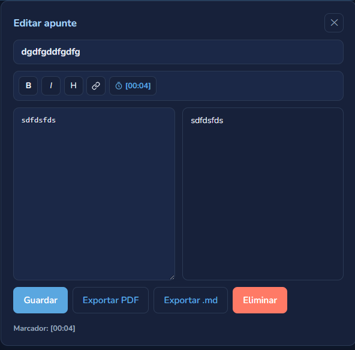
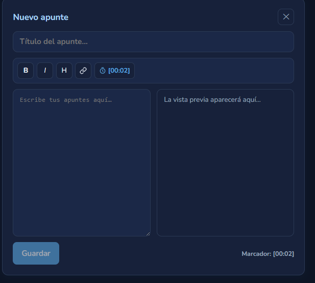

# Informe Técnico y Matriz SOLID — YoUSAC (Práctica 5)

Proyecto: YoUSAC · Práctica: 2 · Carné: 202307691 · Curso: Software Avanzado · Semestre: 2.º 2026 · Fecha: Agosto 2026

## 1. Introducción

Este informe documenta la práctica del módulo de apuntes del sistema YoUSAC, así como la verificación del pipeline de integración continua (CI).

## 3. Evidencias del pipeline CI/CD

## 4. Registry de imágenes

## 5. Funcionalidad del cuaderno de apuntes
Se trabajó en el Microservicio de reproducción, esto porque este microservicio tiene integrada la funcionalidad de capturar la reproducción de un video en cierto tiempo.

Cuenta con lo siguiente:
1. Editor de apuntes: el ApunteEditor se abre en el panel lateral derecho reemplazando el panel del cursillo, este permite escribir en Markdown con vista previa.

2. Nuevo apunte: desde el reproductor, la barra de progreso ofrece "Nuevo apunte" cuando no existe apunte cercano a la posición del cursor.

3. Pines de posición: cada apunte queda marcado con el icono de lápiz en posicion segundos exacta, al pasar el cursor se muestra "Ver apunte" si ya existe uno cerca.

4. Exportación: botones "Exportar PDF" (jsPDF, renderizado enriquecido) y "Exportar .md" (Markdown del apunte abierto, generado en el navegador).

## 6. Conclusiones
