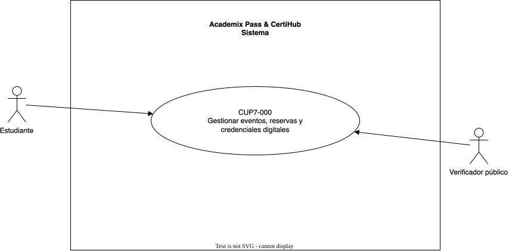
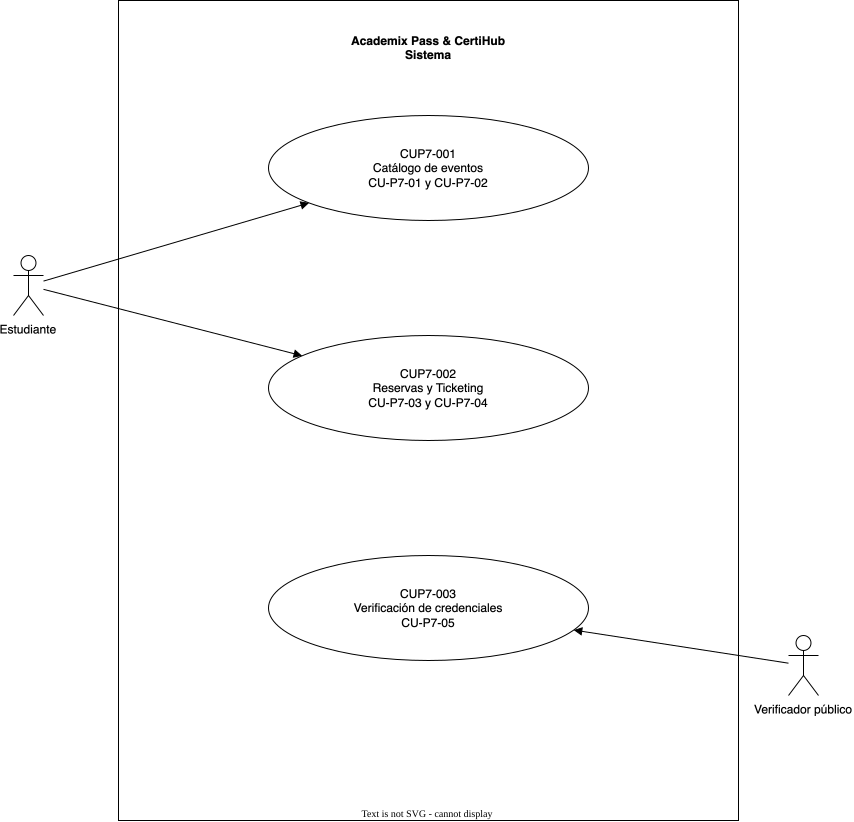
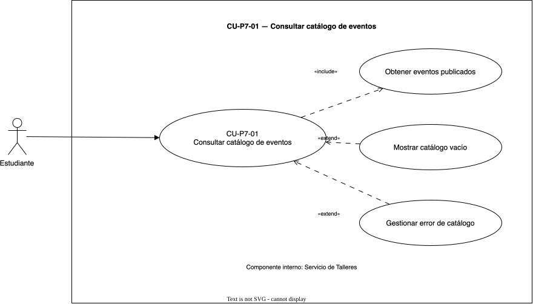
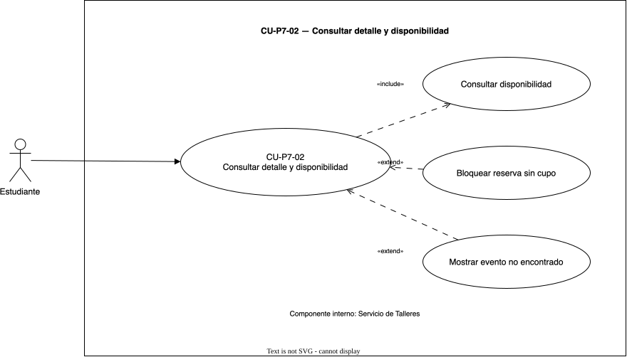
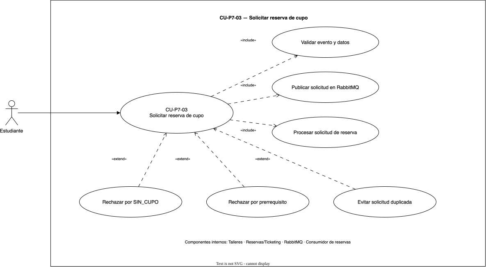
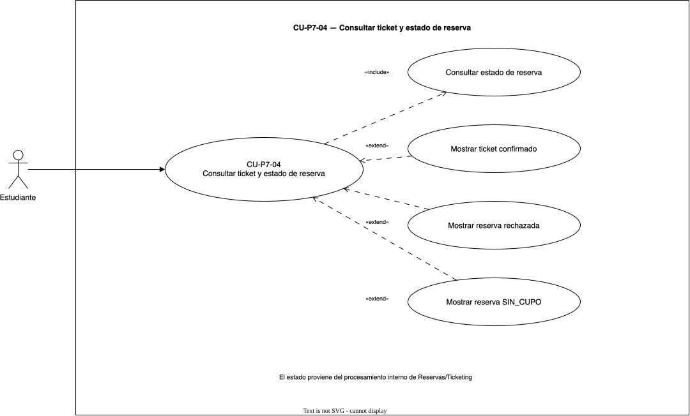
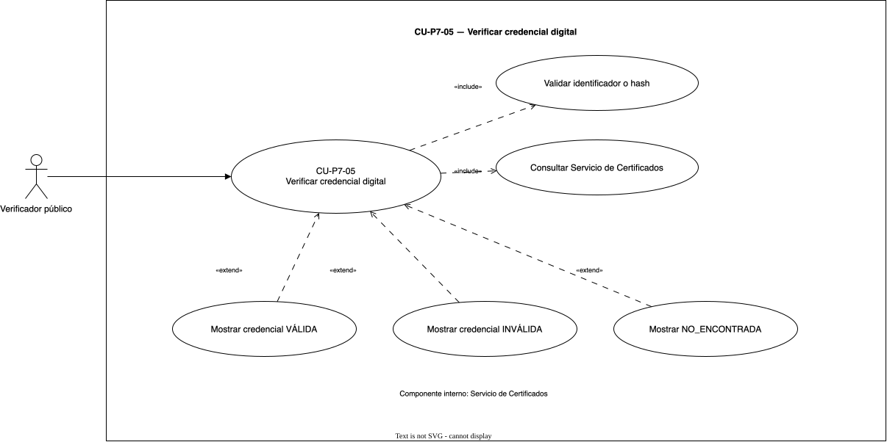

# Documento técnico inicial — YOUSAC Academix Pass & CertiHub

**Práctica:** 7
**Curso:** Software Avanzado
**Institución:** Universidad de San Carlos de Guatemala
**Estado del documento:** Primera entrega documental
**Identificadores:** RF-P7, RNF-P7 y CU-P7

> Este documento define el alcance inicial, los actores, los servicios y los
> requisitos de **YOUSAC Academix Pass & CertiHub**. La solución se plantea
> como un sistema satélite independiente del proyecto principal YOUSAC.
>
> El enunciado de referencia se encuentra en
> [context/practica7.md](../../context/practica7.md).

## Índice

1. [Introducción](#1-introducción)
2. [Objetivos](#2-objetivos)
3. [Identidad y relación con YOUSAC](#3-identidad-y-relación-con-yousac)
4. [Alcance del sistema](#4-alcance-del-sistema)
5. [Glosario del dominio](#5-glosario-del-dominio)
6. [Actores](#6-actores)
7. [Servicios conceptuales](#7-servicios-conceptuales)
8. [Requerimientos del sistema](#8-requerimientos-del-sistema)
9. [Casos de uso iniciales](#9-casos-de-uso-iniciales)
   9.1 [CU-P7-01: Consultar catálogo de eventos](#cu-p7-01-consultar-catálogo-de-eventos)
   9.2 [CU-P7-02: Consultar detalle y disponibilidad](#cu-p7-02-consultar-detalle-y-disponibilidad)
   9.3 [CU-P7-03: Solicitar reserva de cupo](#cu-p7-03-solicitar-reserva-de-cupo)
   9.4 [CU-P7-04: Consultar ticket y estado de reserva](#cu-p7-04-consultar-ticket-y-estado-de-reserva)
   9.5 [CU-P7-05: Verificar credencial digital](#cu-p7-05-verificar-credencial-digital)
   9.6 [Diagramas de casos de uso](#96-diagramas-de-casos-de-uso)
10. [Estados del dominio](#10-estados-del-dominio)
11. [Flujo conceptual de reserva](#11-flujo-conceptual-de-reserva)
12. [Contratos lógicos y mocks](#12-contratos-lógicos-y-mocks)
13. [Supuestos y decisiones](#13-supuestos-y-decisiones)
14. [Trabajo pendiente](#14-trabajo-pendiente)

## 1. Introducción

La Facultad de Ingeniería requiere ampliar el ecosistema YOUSAC con un sistema
satélite orientado a actividades académicas de participación limitada. Este
sistema se denomina **YOUSAC Academix Pass & CertiHub** y atiende eventos que
requieren reserva de cupo, como talleres prácticos, conferencias interactivas,
laboratorios y actividades de certificación.

La diferencia principal respecto de YOUSAC es el dominio funcional. YOUSAC
centraliza clases grabadas y recursos de aprendizaje; Academix Pass & CertiHub
gestiona eventos con cupos limitados, solicitudes de reserva y validación de
credenciales digitales.

La primera entrega se concentra en la documentación de ingeniería de software
y en la definición del frontend que posteriormente será desplegado de forma
pública en Vercel. Los servicios de backend, la persistencia y el broker se
representan en esta etapa mediante arquitectura conceptual, contratos lógicos
y mocks documentados.

## 2. Objetivos

### 2.1 Objetivo general

Definir la arquitectura, los requisitos y los flujos principales de un sistema
satélite de reservas académicas y verificación de certificados digitales,
estableciendo una base trazable para el posterior desarrollo del frontend.

### 2.2 Objetivos específicos

- Permitir la consulta de eventos académicos vinculados con cursos de YOUSAC.
- Modelar la solicitud de reservas para eventos con cupo limitado.
- Representar el procesamiento asíncrono de una reserva mediante RabbitMQ.
- Permitir la consulta pública de la validez de una credencial digital.
- Definir contratos y mocks que puedan ser consumidos por un frontend
  independiente.
- Mantener separadas las responsabilidades de talleres, reservas y
  certificados.

## 3. Identidad y relación con YOUSAC

Academix Pass & CertiHub es un sistema satélite: comparte el contexto académico
de YOUSAC, pero tiene responsabilidades, flujos y servicios propios.

| Aspecto | YOUSAC | Academix Pass & CertiHub |
|---|---|---|
| Propósito | Consulta y reproducción de clases grabadas | Inscripción a eventos y verificación de credenciales |
| Unidad principal | Curso, clase y recurso académico | Evento, reserva, ticket y certificado |
| Flujo crítico | Reproducción de contenido | Reserva concurrente de cupos |
| Comunicación central | Servicios de YOUSAC | Servicios SOA y eventos mediante RabbitMQ |
| Frontend | Aplicación principal en Frontend/ | Aplicación independiente planificada para una fase posterior |

La documentación de esta práctica no modifica los servicios, contratos,
esquemas ni rutas del proyecto principal.

## 4. Alcance del sistema

### 4.1 Funcionalidades incluidas

#### Catálogo de eventos

El usuario podrá consultar eventos académicos publicados y relacionados con
cursos de YOUSAC. Cada evento deberá mostrar, como mínimo:

- Nombre y descripción.
- Curso relacionado.
- Ponente o responsable.
- Fecha y modalidad.
- Cupo total y cupos disponibles.
- Prerrequisitos.

#### Reserva simulada de cupo

El estudiante podrá seleccionar un evento e iniciar una solicitud de reserva
para participar en un taller, acreditación o examen de certificación. La
primera versión mostrará el proceso mediante contratos y mocks, incluyendo el
estado de procesamiento y la emisión simulada de un ticket.

#### Verificación pública de credenciales

Una persona sin autenticación podrá ingresar un identificador único o hash de
un diploma y consultar si la credencial es válida, inválida o no encontrada.

#### Despliegue futuro del frontend

El frontend deberá construirse posteriormente como una aplicación
independiente y publicarse en un dominio de Vercel. La evaluación no deberá
depender de localhost.

### 4.2 Funcionalidades excluidas de esta primera entrega

- Pantallas administrativas para crear, editar o publicar eventos.
- Implementación productiva de los microservicios.
- Persistencia real de eventos, reservas o certificados.
- Despliegue real de RabbitMQ, Redis, Kubernetes o un Container Registry.
- Integración con autenticación institucional de YOUSAC.
- Emisión real de certificados con firma criptográfica.
- Modificación de las rutas o componentes del frontend principal.

La administración de eventos y la emisión de certificados se consideran
responsabilidades internas de los servicios correspondientes y serán
documentadas como parte de la arquitectura futura, pero no como flujos de
usuario del frontend inicial.

## 5. Glosario del dominio

| Término | Definición |
|---|---|
| Evento | Actividad académica publicada y asociada a un curso o área de YOUSAC. |
| Cupo | Capacidad máxima de participantes permitidos para un evento. |
| Reserva | Solicitud de participación enviada por un estudiante para un evento. |
| Ticket | Comprobante simulado que identifica una reserva procesada. |
| Certificado | Diploma digital asociado con una actividad académica completada. |
| Hash de verificación | Identificador utilizado para consultar públicamente una credencial. |
| Broker | Componente que recibe y entrega mensajes asíncronos entre productores y consumidores. |
| Productor | Componente que publica una solicitud o evento en RabbitMQ. |
| Consumidor | Componente que procesa una solicitud recibida desde una cola. |
| Estado de reserva | Situación actual de una solicitud: pendiente, confirmada, rechazada o sin cupo. |

## 6. Actores

### 6.1 Estudiante

Consulta el catálogo, revisa los detalles de un evento, inicia una reserva y
consulta el ticket o estado resultante.

### 6.2 Verificador público

Accede al portal público e ingresa un identificador o hash para consultar la
validez de una credencial digital. No requiere autenticación.

### 6.3 Componentes internos

Los servicios de Talleres, Reservas/Ticketing y Certificados no son actores
humanos. Se documentan como componentes internos que colaboran para cumplir
los casos de uso del sistema.

## 7. Servicios conceptuales

### 7.1 Servicio de Talleres

Responsabilidades:

- Mantener el catálogo conceptual de eventos.
- Exponer detalles del evento.
- Informar cupo total y disponibilidad.
- Informar prerrequisitos y curso relacionado.

### 7.2 Servicio de Reservas/Ticketing

Responsabilidades:

- Recibir solicitudes de reserva.
- Validar que el evento exista y tenga disponibilidad.
- Publicar la solicitud en RabbitMQ.
- Procesar el resultado de la reserva.
- Mantener el estado conceptual de la solicitud.
- Generar un ticket simulado cuando la reserva sea confirmada.

### 7.3 Servicio de Certificados

Responsabilidades:

- Mantener la información conceptual de credenciales emitidas.
- Generar o asociar identificadores de verificación.
- Resolver consultas públicas por identificador o hash.
- Responder con el estado de la credencial y sus datos académicos mínimos.

## 8. Requerimientos del sistema

### 8.1 Requerimientos funcionales

| ID | Nombre | Descripción | Prioridad | Criterio de aceptación | Caso de uso |
|---|---|---|---|---|---|
| RF-P7-01 | Consultar catálogo | El sistema debe mostrar los eventos académicos publicados y vinculados con cursos de YOUSAC. | Alta | El estudiante puede visualizar una lista de eventos usando datos del contrato mock de catálogo. | CU-P7-01 |
| RF-P7-02 | Consultar detalle del evento | El sistema debe mostrar nombre, descripción, ponente, fecha, modalidad, curso y prerrequisitos del evento seleccionado. | Alta | Al seleccionar un evento, se muestran todos los campos obligatorios definidos para el catálogo. | CU-P7-02 |
| RF-P7-03 | Consultar disponibilidad | El sistema debe mostrar el cupo total y los cupos disponibles de cada evento. | Alta | El detalle refleja el valor de disponibilidad entregado por el mock y distingue un evento sin cupo. | CU-P7-02 |
| RF-P7-04 | Solicitar reserva | El estudiante debe poder iniciar una solicitud de reserva para un evento disponible. | Alta | El formulario valida el evento y muestra confirmación de que la solicitud fue enviada. | CU-P7-03 |
| RF-P7-05 | Procesar ticket simulado | El sistema debe representar la emisión de un ticket después de que la solicitud sea procesada. | Alta | Una solicitud confirmada muestra un identificador de ticket y los datos básicos del evento. | CU-P7-04 |
| RF-P7-06 | Consultar estado de reserva | El estudiante debe poder consultar si su reserva está pendiente, confirmada, rechazada o sin cupo. | Alta | La interfaz muestra exactamente uno de los estados definidos y una explicación para el usuario. | CU-P7-04 |
| RF-P7-07 | Consultar credencial | El sistema debe permitir ingresar un identificador único o hash de un diploma desde una vista pública. | Alta | El verificador puede enviar una consulta sin autenticarse. | CU-P7-05 |
| RF-P7-08 | Mostrar resultado de verificación | El sistema debe informar si la credencial es válida, inválida o no encontrada. | Alta | Para cada respuesta del contrato mock se muestra un estado inequívoco y los datos académicos disponibles. | CU-P7-05 |

### 8.2 Requerimientos no funcionales

| ID | Nombre | Descripción cuantitativa | Prioridad | Criterio de aceptación | Caso de uso relacionado |
|---|---|---|---|---|---|
| RNF-P7-01 | Accesibilidad de evaluación | El 100% de los flujos principales deberá estar disponible mediante el dominio público de Vercel durante la evaluación. | Alta | Catálogo, reserva simulada y verificación se pueden abrir desde la URL pública sin depender de localhost. | CU-P7-01 a CU-P7-05 |
| RNF-P7-02 | Rendimiento percibido | El 95% de las respuestas de los mocks deberá reflejarse en la interfaz en un máximo de 2 segundos bajo condiciones normales de red. | Media | Las pantallas no quedan bloqueadas y muestran el resultado dentro del límite definido. | CU-P7-01 a CU-P7-05 |
| RNF-P7-03 | Diseño responsive | La interfaz deberá ser usable en al menos tres anchos: 360 px, 768 px y 1440 px. | Media | Las tres vistas principales conservan navegación y contenido legible en los tres anchos. | CU-P7-01 a CU-P7-05 |
| RNF-P7-04 | Estados de interacción | El 100% de las operaciones asíncronas deberá mostrar estado de carga, éxito y error. | Alta | Reserva y verificación tienen mensajes diferenciados para carga, respuesta correcta y fallo. | CU-P7-03 a CU-P7-05 |
| RNF-P7-05 | Seguridad del frontend | Se deberán mantener 0 secretos, credenciales o claves privadas dentro del código público o del repositorio documental. | Alta | La búsqueda pública solo utiliza datos de prueba y no expone credenciales reales. | CU-P7-05 |
| RNF-P7-06 | Contratos y mocks | El 100% de las operaciones del frontend deberá consumir interfaces mock documentadas. | Alta | Cada operación de catálogo, reserva y verificación tiene un contrato lógico asociado. | CU-P7-01 a CU-P7-05 |
| RNF-P7-07 | Trazabilidad | El 100% de los RF deberá relacionarse con al menos un caso de uso y un criterio de aceptación. | Media | La tabla de requisitos mantiene la columna de caso de uso y evidencia verificable. | CU-P7-01 a CU-P7-05 |

## 9. Casos de uso iniciales

Estos casos de uso delimitan la primera versión de la documentación. Las
narrativas se presentan en formato académico y los diagramas UML
correspondientes se incluyen en la sección 9.6 junto con sus fuentes editables.

| ID | Caso de uso | Actor principal | Resultado esperado |
|---|---|---|---|
| CU-P7-01 | Consultar catálogo de eventos | Estudiante | El estudiante visualiza los eventos académicos publicados. |
| CU-P7-02 | Consultar detalle y disponibilidad | Estudiante | El estudiante conoce los datos del evento y sus cupos disponibles. |
| CU-P7-03 | Solicitar reserva de cupo | Estudiante | La solicitud queda registrada para su procesamiento asíncrono. |
| CU-P7-04 | Consultar ticket y estado de reserva | Estudiante | El estudiante visualiza el estado de la reserva y el ticket si fue confirmado. |
| CU-P7-05 | Verificar credencial digital | Verificador público | El sistema informa la validez de la credencial consultada. |

### Identificadores de alto nivel y módulos

El caso de uso de alto nivel y la primera descomposición utilizan identificadores
distintos de los cinco casos concretos para evitar confundir módulos con casos de
uso ejecutados directamente por el usuario.

| Nivel | Identificador | Nombre | Casos concretos relacionados |
|---|---|---|---|
| Alto nivel | CU-P7-00 | Consultar eventos, solicitar reservas y verificar credenciales digitales | CU-P7-01 a CU-P7-05 |
| Módulo | M-P7-01 | Catálogo de eventos | CU-P7-01, CU-P7-02 |
| Módulo | M-P7-02 | Reservas y Ticketing | CU-P7-03, CU-P7-04 |
| Módulo | M-P7-03 | Verificación de credenciales | CU-P7-05 |

### CU-P7-01: Consultar catálogo de eventos

| Campo | Descripción |
|---|---|
| ID | CU-P7-01 |
| Nombre | Consultar catálogo de eventos |
| Actor principal | Estudiante |
| Descripción | Permite al estudiante consultar los eventos académicos publicados por el Servicio de Talleres. |
| Precondiciones | El frontend está disponible y el contrato de catálogo puede ser consultado. |
| Postcondiciones | Se muestra una lista de eventos con sus datos principales o un estado vacío si no existen eventos publicados. |
| Requerimientos relacionados | RF-P7-01 |
| Servicios y componentes participantes | Frontend independiente, Servicio de Talleres y contrato mock GET /mock/events. |

**Flujo principal:**

| Paso | Actor o componente | Acción |
|---|---|---|
| 1 | Estudiante | Accede a la vista de catálogo de Academix Pass & CertiHub. |
| 2 | Frontend | Solicita al contrato de catálogo la lista de eventos publicados. |
| 3 | Servicio de Talleres | Retorna los eventos disponibles con sus datos resumidos. |
| 4 | Frontend | Valida que cada evento tenga identificador, nombre, curso, ponente, fecha y disponibilidad. |
| 5 | Frontend | Muestra las tarjetas o filas de los eventos publicados. |
| 6 | Estudiante | Selecciona un evento para consultar su información completa mediante CU-P7-02. |

**Flujos alternativos:**

| ID | Condición | Acción |
|---|---|---|
| FA-01 | No existen eventos publicados | El frontend muestra un estado vacío con un mensaje informativo y conserva disponible la navegación del sistema. |
| FA-02 | Un evento no tiene cupos disponibles | El evento permanece visible, pero se identifica como SIN_CUPO para que el estudiante conozca su disponibilidad antes de abrir el detalle. |

**Flujos de excepción:**

| ID | Condición | Acción |
|---|---|---|
| FE-01 | El contrato de catálogo no responde | El frontend muestra un mensaje de error y ofrece reintentar la consulta. |
| FE-02 | La respuesta contiene datos incompletos o inválidos | El frontend no muestra información inconsistente, registra el estado de error de la consulta y solicita reintentar. |

**Reglas de negocio:**

- Solo se muestran eventos marcados como publicados.
- La cantidad de cupos disponibles no puede ser negativa ni superar el cupo total.
- La consulta del catálogo no inicia una reserva.

### CU-P7-02: Consultar detalle y disponibilidad

| Campo | Descripción |
|---|---|
| ID | CU-P7-02 |
| Nombre | Consultar detalle y disponibilidad |
| Actor principal | Estudiante |
| Descripción | Permite consultar la información completa de un evento y determinar si puede iniciar una reserva. |
| Precondiciones | El estudiante seleccionó un evento del catálogo y se dispone de su identificador. |
| Postcondiciones | Se muestran los datos completos del evento, sus prerrequisitos y el estado del botón de reserva. |
| Requerimientos relacionados | RF-P7-02, RF-P7-03 |
| Servicios y componentes participantes | Frontend independiente, Servicio de Talleres y contrato mock GET /mock/events/{eventId}. |

**Flujo principal:**

| Paso | Actor o componente | Acción |
|---|---|---|
| 1 | Estudiante | Selecciona un evento desde el catálogo. |
| 2 | Frontend | Solicita el detalle utilizando el identificador del evento. |
| 3 | Servicio de Talleres | Retorna nombre, descripción, curso, ponente, fecha, modalidad, cupo y prerrequisitos. |
| 4 | Frontend | Valida y presenta la información completa del evento. |
| 5 | Frontend | Calcula visualmente si existen cupos disponibles para iniciar una reserva. |
| 6 | Estudiante | Revisa los prerrequisitos y decide iniciar la reserva o regresar al catálogo. |
| 7 | Frontend | Habilita la acción de reserva cuando el evento tiene disponibilidad y dirige a CU-P7-03. |

**Flujos alternativos:**

| ID | Condición | Acción |
|---|---|---|
| FA-01 | El evento no tiene cupos disponibles | El frontend muestra SIN_CUPO, deshabilita la acción de reserva y permite volver al catálogo. |
| FA-02 | El evento no declara prerrequisitos | El frontend muestra que no existen prerrequisitos registrados y mantiene disponible la acción de reserva si hay cupo. |
| FA-03 | El estudiante decide no continuar | El frontend conserva el detalle consultado y permite regresar al catálogo sin crear una reserva. |

**Flujos de excepción:**

| ID | Condición | Acción |
|---|---|---|
| FE-01 | El identificador no corresponde a un evento | El frontend muestra que el evento no fue encontrado y ofrece regresar al catálogo. |
| FE-02 | El Servicio de Talleres no está disponible | El frontend muestra un error de consulta y ofrece reintentar. |

**Reglas de negocio:**

- Un evento sin cupos no puede iniciar una reserva.
- Los prerrequisitos se muestran como información del evento; la validación productiva de elegibilidad queda fuera de esta primera entrega.
- La disponibilidad mostrada proviene del contrato de catálogo o del mock documentado.

### CU-P7-03: Solicitar reserva de cupo

| Campo | Descripción |
|---|---|
| ID | CU-P7-03 |
| Nombre | Solicitar reserva de cupo |
| Actor principal | Estudiante |
| Descripción | Permite enviar una solicitud de reserva para un evento disponible, registrarla en estado PENDIENTE y dejarla lista para procesamiento asíncrono. |
| Precondiciones | El estudiante consultó un evento disponible, cuenta con una identidad de prueba y no existe una solicitud confirmada duplicada para el mismo evento. |
| Postcondiciones | Se genera un identificador de reserva y la solicitud queda inicialmente en estado PENDIENTE; todavía no se emite un ticket confirmado. |
| Requerimientos relacionados | RF-P7-04 |
| Servicios y componentes participantes | Frontend independiente, Servicio de Talleres, Servicio de Reservas/Ticketing, RabbitMQ, consumidor de reservas y contrato mock POST /mock/reservations. |

**Flujo principal:**

| Paso | Actor o componente | Acción |
|---|---|---|
| 1 | Estudiante | Selecciona la acción de reservar desde el detalle de un evento disponible. |
| 2 | Frontend | Solicita o confirma los datos mínimos de la reserva y muestra un resumen del evento. |
| 3 | Estudiante | Confirma el envío de la solicitud. |
| 4 | Frontend | Envía eventId y los datos mínimos del estudiante al Servicio de Reservas/Ticketing. |
| 5 | Servicio de Reservas/Ticketing | Valida que el evento exista y que la solicitud tenga los datos requeridos. |
| 6 | Servicio de Reservas/Ticketing | Crea la solicitud con identificador propio y estado PENDIENTE. |
| 7 | Servicio de Reservas/Ticketing | Publica el evento de reserva solicitada en RabbitMQ para su procesamiento interno. |
| 8 | Consumidor de reservas | Recibe el mensaje, valida capacidad y reglas de negocio, y comunica el resultado al Servicio de Reservas/Ticketing. |
| 9 | Frontend | Muestra el identificador de reserva y el estado inicial PENDIENTE, dirigiendo a CU-P7-04 para consultar el resultado. |

**Flujos alternativos:**

| ID | Condición | Acción |
|---|---|---|
| FA-01 | El evento pierde disponibilidad antes de publicar la solicitud | El Servicio de Reservas/Ticketing rechaza la operación con estado SIN_CUPO y no genera ticket. |
| FA-02 | El estudiante no cumple un prerrequisito requerido | El consumidor procesa la regla y actualiza la solicitud a RECHAZADA, mostrando el motivo al estudiante. |
| FA-03 | Ya existe una solicitud del mismo estudiante para el evento | El servicio devuelve la reserva existente y evita publicar una solicitud duplicada. |

**Flujos de excepción:**

| ID | Condición | Acción |
|---|---|---|
| FE-01 | Faltan datos obligatorios o el evento no es válido | El frontend impide el envío, muestra los campos que deben corregirse y no crea una reserva. |
| FE-02 | El Servicio de Reservas/Ticketing no está disponible | El frontend informa que la solicitud no pudo enviarse y permite reintentar sin mostrar una reserva confirmada. |
| FE-03 | RabbitMQ no acepta el mensaje | La solicitud no se presenta como confirmada; el servicio informa el fallo de procesamiento y permite reintentar según el contrato definido. |

**Reglas de negocio:**

- El frontend no se conecta directamente con RabbitMQ.
- CU-P7-03 concluye para el frontend cuando la solicitud tiene identificador y estado PENDIENTE; el resultado final se consulta mediante CU-P7-04.
- Una solicitud PENDIENTE no genera un ticket confirmado.
- La verificación definitiva de cupo se realiza durante el procesamiento interno.
- El procesamiento debe ser idempotente para evitar más de una reserva confirmada por estudiante y evento.

### CU-P7-04: Consultar ticket y estado de reserva

| Campo | Descripción |
|---|---|
| ID | CU-P7-04 |
| Nombre | Consultar ticket y estado de reserva |
| Actor principal | Estudiante |
| Descripción | Permite consultar el resultado actualizado de una solicitud de reserva y visualizar el ticket cuando corresponda. |
| Precondiciones | El estudiante posee un identificador de reserva obtenido durante CU-P7-03 o una reserva de prueba válida. |
| Postcondiciones | Se muestra el estado actual de la reserva, el motivo cuando corresponda y el ticket si la reserva fue confirmada. |
| Requerimientos relacionados | RF-P7-05, RF-P7-06 |
| Servicios y componentes participantes | Frontend independiente, Servicio de Reservas/Ticketing, consumidor de reservas y contrato mock GET /mock/reservations/{reservationId}. |

**Flujo principal:**

| Paso | Actor o componente | Acción |
|---|---|---|
| 1 | Estudiante | Accede a la consulta de reserva e ingresa el identificador recibido. |
| 2 | Frontend | Valida que el identificador tenga un formato permitido. |
| 3 | Frontend | Solicita el estado al Servicio de Reservas/Ticketing. |
| 4 | Servicio de Reservas/Ticketing | Retorna el estado actual, mensaje y ticket cuando exista. |
| 5 | Frontend | Interpreta el estado y muestra la información correspondiente. |
| 6 | Estudiante | Consulta nuevamente cuando la reserva permanece PENDIENTE o revisa el ticket cuando está CONFIRMADA. |

**Flujos alternativos:**

| ID | Condición | Acción |
|---|---|---|
| FA-01 | La reserva está PENDIENTE | El frontend muestra que el procesamiento continúa y permite actualizar la consulta. |
| FA-02 | La reserva está CONFIRMADA | El frontend muestra los datos del evento, el identificador del ticket y las instrucciones disponibles. |
| FA-03 | La reserva está RECHAZADA | El frontend muestra el estado y el motivo informado por el servicio; no presenta ticket. |
| FA-04 | La reserva está SIN_CUPO | El frontend informa que no se pudo asignar cupo y no presenta ticket confirmado. |

**Flujos de excepción:**

| ID | Condición | Acción |
|---|---|---|
| FE-01 | El identificador no corresponde a una reserva | El frontend muestra que la reserva no fue encontrada y solicita verificar el dato. |
| FE-02 | El Servicio de Reservas/Ticketing no responde | El frontend muestra un error temporal y permite reintentar la consulta. |
| FE-03 | La respuesta no contiene un estado válido | El frontend evita mostrar un resultado ambiguo y presenta un error de procesamiento. |

**Reglas de negocio:**

- Los estados válidos son PENDIENTE, CONFIRMADA, RECHAZADA y SIN_CUPO.
- Solo una reserva CONFIRMADA puede mostrar un ticket.
- Una reserva en estado terminal no debe cambiar a otro estado sin una operación administrativa definida en una fase posterior.
- La consulta del estado no publica nuevos mensajes en RabbitMQ; consulta el resultado producido por el procesamiento interno.

### CU-P7-05: Verificar credencial digital

| Campo | Descripción |
|---|---|
| ID | CU-P7-05 |
| Nombre | Verificar credencial digital |
| Actor principal | Verificador público |
| Descripción | Permite consultar públicamente la validez académica de un diploma mediante su identificador único o hash. |
| Precondiciones | El portal público está disponible y el verificador cuenta con un identificador o hash para consultar. |
| Postcondiciones | Se muestra el estado de la credencial y únicamente los datos académicos disponibles para verificación pública. |
| Requerimientos relacionados | RF-P7-07, RF-P7-08 |
| Servicios y componentes participantes | Frontend independiente, Servicio de Certificados y contrato mock GET /mock/credentials/verify. |

**Flujo principal:**

| Paso | Actor o componente | Acción |
|---|---|---|
| 1 | Verificador público | Accede al portal de verificación sin autenticarse. |
| 2 | Verificador público | Ingresa el identificador único o hash del diploma. |
| 3 | Frontend | Valida que el campo no esté vacío y normaliza el valor ingresado. |
| 4 | Frontend | Envía la consulta al Servicio de Certificados. |
| 5 | Servicio de Certificados | Busca la credencial asociada con el identificador recibido. |
| 6 | Servicio de Certificados | Retorna el estado de verificación y los datos públicos disponibles. |
| 7 | Frontend | Muestra el resultado de manera clara, indicando si la credencial es válida, inválida o no encontrada. |

**Flujos alternativos:**

| ID | Condición | Acción |
|---|---|---|
| FA-01 | La credencial es VÁLIDA | El frontend muestra el estado válido, el nombre de la actividad y los datos académicos autorizados. |
| FA-02 | La credencial es INVÁLIDA | El frontend muestra el estado inválido sin exponer datos internos del certificado. |
| FA-03 | La credencial es NO_ENCONTRADA | El frontend informa que no existe una credencial asociada con el valor consultado. |

**Flujos de excepción:**

| ID | Condición | Acción |
|---|---|---|
| FE-01 | El campo está vacío o tiene un formato no permitido | El frontend solicita un identificador válido y no envía la consulta. |
| FE-02 | El Servicio de Certificados no está disponible | El frontend muestra un error temporal y permite reintentar. |
| FE-03 | La respuesta no contiene un estado de verificación válido | El frontend muestra un error de procesamiento y no declara la credencial como válida. |

**Reglas de negocio:**

- La verificación pública no requiere autenticación.
- Los estados válidos son VÁLIDA, INVÁLIDA y NO_ENCONTRADA.
- La consulta solo devuelve los datos definidos como públicos.
- Este caso de uso verifica credenciales; no emite ni modifica certificados.

### 9.6 Diagramas de casos de uso

Los siguientes diagramas representan el alcance de la Práctica 7 y mantienen
separada esta solución satélite del proyecto principal YOUSAC. Cada imagen SVG
se acompaña de su fuente editable en formato `.drawio`.

#### Diagrama de alto nivel

[Fuente editable del diagrama de alto nivel](CDU/CDU_AltoNivel_P7_202307691.drawio)

#### Primera descomposición

[Fuente editable de la primera descomposición](CDU/CDU_PrimeraDescomposicion_P7_202307691.drawio)

#### Casos de uso expandidos

##### CU-P7-01 — Consultar catálogo de eventos

[Fuente editable del CU-P7-01](CDU/CDU_Expandido_CUP7_01_202307691.drawio)

##### CU-P7-02 — Consultar detalle y disponibilidad

[Fuente editable del CU-P7-02](CDU/CDU_Expandido_CUP7_02_202307691.drawio)

##### CU-P7-03 — Solicitar reserva de cupo

[Fuente editable del CU-P7-03](CDU/CDU_Expandido_CUP7_03_202307691.drawio)

##### CU-P7-04 — Consultar ticket y estado de reserva

[Fuente editable del CU-P7-04](CDU/CDU_Expandido_CUP7_04_202307691.drawio)

##### CU-P7-05 — Verificar credencial digital

[Fuente editable del CU-P7-05](CDU/CDU_Expandido_CUP7_05_202307691.drawio)

## 10. Estados del dominio

### 10.1 Estados de una reserva

| Estado | Descripción |
|---|---|
| PENDIENTE | La solicitud fue recibida y espera procesamiento. |
| CONFIRMADA | La reserva fue aceptada y existe un ticket asociado. |
| RECHAZADA | La solicitud no fue aceptada por una regla de negocio. |
| SIN_CUPO | La solicitud no pudo confirmarse porque el evento alcanzó su capacidad. |

### 10.2 Estados de verificación

| Estado | Descripción |
|---|---|
| VÁLIDA | El identificador corresponde a una credencial emitida y vigente. |
| INVÁLIDA | La credencial existe, pero no cumple las condiciones de validez. |
| NO_ENCONTRADA | No existe una credencial asociada con el identificador consultado. |

## 11. Flujo conceptual de reserva

El frontend no se conecta directamente con RabbitMQ. CU-P7-03 termina para el
frontend cuando Servicio de Reservas/Ticketing registra la solicitud con un
`reservationId`, la deja en estado `PENDIENTE` y publica el mensaje. El
consumidor procesa el mensaje de forma interna y CU-P7-04 consulta el resultado
posteriormente. La comunicación con el broker se representa conceptualmente así:

~~~mermaid
sequenceDiagram
    actor E as Estudiante
    participant F as Frontend Academix Pass
    participant T as Servicio de Talleres
    participant R as Servicio de Reservas/Ticketing
    participant B as RabbitMQ
    participant C as Consumidor de reservas

    E->>F: Selecciona evento y solicita reserva
    F->>T: Consulta disponibilidad
    T-->>F: Evento y cupos disponibles
    F->>R: Envía solicitud de reserva
    R->>R: Registra reservationId y estado PENDIENTE
    R->>B: Publica reserva solicitada
    R-->>F: reservationId y estado PENDIENTE
    F-->>E: Muestra solicitud registrada
    B->>C: Entrega mensaje de la cola
    C->>C: Valida capacidad y reglas
    C-->>R: Actualiza resultado
    E->>F: Consulta el estado de la reserva
    F->>R: Solicita resultado por reservationId
    R-->>F: Estado y ticket si existe
    F-->>E: Muestra el resultado de la reserva
~~~

El consumidor debe procesar la operación de forma idempotente para evitar que
una solicitud duplicada genere más de un ticket confirmado. Esta regla queda
como decisión arquitectónica para la documentación de vistas de procesos y
persistencia.

## 12. Contratos lógicos y mocks

Los siguientes contratos son interfaces lógicas para el frontend futuro. No
representan endpoints implementados en el backend actual.

| Operación | Entrada | Respuesta mínima |
|---|---|---|
| GET /mock/events | Filtros opcionales del catálogo | Lista de eventos con disponibilidad y prerrequisitos. |
| GET /mock/events/{eventId} | Identificador del evento | Detalle completo del evento y sus cupos. |
| POST /mock/reservations | eventId y datos mínimos del estudiante | reservationId y estado inicial PENDIENTE. |
| GET /mock/reservations/{reservationId} | Identificador de reserva | Estado, mensaje y ticket cuando exista. |
| GET /mock/credentials/verify?identifier= | Identificador o hash | Estado de verificación y datos académicos disponibles. |

Los mocks deberán contemplar al menos:

- Evento con cupos disponibles.
- Evento sin cupo.
- Reserva pendiente.
- Reserva confirmada con ticket.
- Reserva rechazada.
- Credencial válida.
- Credencial inválida.
- Credencial no encontrada.
- Error de comunicación.

## 13. Supuestos y decisiones

### 13.1 Decisiones adoptadas

| Decisión | Justificación |
|---|---|
| Sistema satélite separado | El dominio de reservas y credenciales no se incorpora como un módulo de los servicios actuales de YOUSAC. |
| Documentación inicial aislada | Los archivos de esta fase se ubican en Documentacion/Practica7/ para conservar separados los avances de la práctica. |
| RabbitMQ | El modelo de productor, exchange, cola y consumidor representa de forma directa la reserva asíncrona solicitada y mantiene una complejidad adecuada para la primera documentación. |
| Actores externos limitados | Se documentan únicamente estudiante y verificador público porque son los flujos visibles exigidos para el frontend inicial. |
| Mocks documentados | Permiten construir posteriormente el frontend sin afirmar que existe un backend productivo. |
| Frontend independiente | La futura aplicación de Práctica 7 no agregará rutas ni componentes al Frontend/ principal. |

### 13.2 Supuestos

- Los eventos del catálogo se consideran previamente publicados por el Servicio
  de Talleres.
- El estudiante se identifica mediante datos de prueba en los mocks; no se
  implementa autenticación institucional en esta fase.
- La disponibilidad de cupos se simula mediante respuestas de contrato y no
  constituye todavía una reserva concurrente real.
- La emisión de un certificado ocurre como responsabilidad interna del
  Servicio de Certificados; la interfaz inicial solo verifica credenciales.
- La URL pública de Vercel se configurará cuando se implemente el frontend.

### 13.3 Ambigüedades del enunciado

El documento de referencia presenta diferencias internas que deben confirmarse
con el docente o el equipo:

1. La descripción de la primera fase prioriza documentación y frontend, pero el
   índice y la tabla de herramientas también mencionan backend, CI/CD,
   Container Registry, pruebas, Docker, Redis y Kubernetes.
2. Los entregables detallados y la hoja de calificación se concentran en
   documentación, frontend, archivos editables y trazabilidad Git.
3. El cronograma indica elaboración del 17 al 25 de septiembre, mientras que
   las consideraciones mencionan una fecha límite del 5 de septiembre.
4. Se menciona el repositorio SA_PRACTICA_CARNET, pero también se indica que
   el trabajo debe copiarse al repositorio del proyecto y ubicarse en una
   carpeta identificada por práctica.

Mientras no exista una confirmación distinta, esta primera entrega sigue la
interpretación de documentación, contratos/mocks y frontend futuro, sin
implementar servicios productivos.

## 14. Trabajo pendiente

Las siguientes actividades pertenecen a fases posteriores de la documentación
y no se declaran terminadas en esta entrega:

- Modelo de vistas 4+1 de Kruchten.
- Diagrama de actividades y secuencia con RabbitMQ.
- Diagrama entidad-relación.
- Mockups detallados de las pantallas.
- Matriz de decisiones técnicas completa.
- Archivos editables de las vistas pendientes (.drawio, .puml u otro formato). Los diagramas UML de casos de uso de la sección 9.6 ya cuentan con fuente `.drawio` y representación `.drawio.svg`.
- Implementación y despliegue del frontend independiente en Vercel.
- Pruebas funcionales del frontend con los mocks.
- Confirmación del alcance final de backend, CI/CD, Registry y pruebas.
