# Proyecto YoUSAC

## Índice
1. [Introducción](#introducción)
2. [Descripción del problema](#descripción-del-problema)
3. [Alcance del sistema](#alcance-del-sistema)
4. [Requerimientos del sistema](#requerimientos-del-sistema)
   - 4.1 [Requerimientos Funcionales (RF)](#requerimientos-funcionales-rf)
   - 4.2 [Requerimientos No Funcionales (RNF)](#requerimientos-no-funcionales-rnf)
5. [Modelo de Casos de Uso](#modelo-de-casos-de-uso)
   - 5.1 [Diagrama de alto nivel](#diagrama-de-alto-nivel)
   - 5.2 [Descomposición por módulo](#descomposición-por-módulo)
   - 5.3 [Casos de uso expandidos](#casos-de-uso-expandidos)
6. [Vista de Arquitectura (Modelo 4+1)](#vista-de-arquitectura-modelo-41)
   - 6.1 [Vista de Escenarios](#vista-de-escenarios)
   - 6.2 [Vista Lógica](#vista-lógica)
   - 6.3 [Vista de Procesos](#vista-de-procesos)
   - 6.4 [Vista de Componentes](#vista-de-componentes)
   - 6.5 [Vista de Despliegue](#vista-de-despliegue)
7. [Diseño del Modelado de Datos (DER)](#diseño-del-modelado-de-datos-der)
---

## Introducción
El presente documento describe el análisis, diseño y planificación de la arquitectura del proyecto YoUSAC, una plataforma web de video bajo demanda (VOD) orientada al entorno universitario. Su principal objetivo es centralizar el acceso a las grabaciones de clases impartidas en semestres anteriores, permitiendo a los estudiantes consultar contenido académico, reforzar conocimientos y dar continuidad a su proceso de aprendizaje mediante una experiencia de navegación eficiente y segura.

Para satisfacer los requerimientos de escalabilidad, disponibilidad y alto rendimiento, el sistema se desarrolla siguiendo una arquitectura de microservicios políglota, distribuyendo las responsabilidades entre servicios implementados en Go, TypeScript y Python, cada uno especializado en un dominio específico del negocio. La comunicación entre los microservicios se realiza mediante gRPC y contratos definidos con Protocol Buffers, mientras que el acceso desde el cliente web se centraliza a través de un API Gateway, garantizando un punto de entrada único y seguro.

Asimismo, la solución incorpora mecanismos modernos de autenticación y autorización utilizando JWT, Session Cookies y OAuth 2.0, además de aplicar el patrón Database per Microservice, almacenamiento en caché con Redis, contenedores Docker y despliegue en Google Cloud Platform (GCP). Estas tecnologías permiten construir una plataforma desacoplada, mantenible y preparada para soportar un gran número de usuarios concurrentes.

## Descripción del problema
La Universidad San Carlos de Guatemala crear un sistema para centralizar el acceso a su acervo académico digital mediante una plataforma web de streaming de video bajo demanda (VOD) orientada al entorno universitario. El sistema permitirá a los estudiantes explorar, buscar y visualizar las grabaciones de las clases impartidas en semestres anteriores, facilitando el repaso de contenidos de cara a exámenes, laboratorios y autoformación.

Dado el elevado número de estudiantes conectados de forma concurrente en
periodos de evaluaciones y el volumen de contenido multimedia administrado, la
plataforma debe ser altamente escalable, tolerante a fallos y ofrecer bajos tiempos
de respuesta. Para maximizar el rendimiento y aprovechar las fortalezas específicas
de distintos lenguajes de programación, el departamento de ingeniería ha
determinado construir el sistema bajo una Arquitectura de Microservicios
Políglota.
De forma obligatoria, el backend implementará tres (3) lenguajes de programación
en simultáneo: Go, TypeScript y Python, distribuidos estratégicamente según el
dominio de cada microservicio.

TypeScript (Auth/Catálogo)
Go (Reproducción/Checkpoints)
Python (Analítica)

Toda la comunicación interna entre microservicios (east-west traffic) se realizará
mediante el protocolo síncrono gRPC sobre HTTP/2 con contratos estrictos Protocol
Buffers (.proto). La exposición externa de los servicios hacia el cliente web
(north-south traffic) se centralizará a través de un API Gateway.

La gestión de identidades se garantizará mediante JWT (JSON Web Tokens),
Session Cookies seguras y soporte para autorización delegada vía OAuth 2.0.
Asimismo, la persistencia seguirá el patrón Database per Microservice, integrando
lógica de datos programable en el motor de base de datos (procedimientos
almacenados, vistas, funciones y triggers).

## Alcance del sistema
1. Autenticación, Gestión de Sesiones y Multiperfil
2. Gestión de Inscripción y permisos
3. Catálogo, Búsqueda y Detalle de contenido
4. Servicio de Analítica, Tendencias y Recomendaciones
5. Historial de Reproducción Reciente y Checkpoint de Avance
6. Sistema de notificaciones por Correo

## Requerimientos del sistema
### Requerimientos Funcionales (RF)

| ID | Requerimiento | Descripción | Prioridad |
|---|---|---|---|
| RF-01 | Autenticación institucional exclusiva | El sistema debe permitir registro y acceso únicamente con correo institucional de la Facultad de Ingeniería (@ingenieria.usac.edu.gt / @ing.usac.edu.gt) | Alta |
| RF-02 | Rechazo de correos personales/comerciales | El sistema debe rechazar el acceso con correos personales y comerciales (gmail, hotmail, etc.) | Alta |
| RF-03 | Gestión de sesiones (JWT + Session Cookies) | El sistema debe emitir y validar sesiones mediante JWT y Session Cookies (HttpOnly y Secure) | Alta |
| RF-04 | Login mediante OAuth 2.0 institucional | El sistema debe soportar login mediante OAuth 2.0 institucional | Media |
| RF-05 | Consulta de cursos, matrícula y credenciales | El sistema debe permitir al estudiante consultar sus cursos asignados/inscritos por semestre, el estado de su matriculación y credenciales académicas | Alta |
| RF-06 | Control de acceso basado en roles (RBAC) | El sistema debe controlar el acceso según rol correspondiente (RBAC): Estudiante, Catedrático/Docente, Auxiliar y Administrador | Alta |
| RF-07 | Búsqueda avanzada y filtrado de grabaciones | El sistema debe permitir una búsqueda avanzada y filtrado de grabaciones por Semestre/Año, Escuela, Curso, Catedrático y Temas | Alta |
| RF-08 | Vista detallada / ficha técnica de la clase | El sistema debe mostrar una vista detallada de la clase grabada con su respectiva ficha técnica de cada clase (unidad, fecha, sílabo/material adjunto, docentes/auxiliares) | Media |
| RF-09 | Cálculo de porcentaje de recomendación | El sistema debe calcular y mostrar el porcentaje de recomendación de una clase según valoraciones | Media |
| RF-10 | Registro de checkpoint de reproducción | El sistema debe guardar el checkpoint exacto donde el estudiante detuvo el video | Alta |
| RF-11 | Reanudación desde el último checkpoint | El sistema debe reanudar la reproducción desde el último checkpoint guardado | Alta |
| RF-12 | Cálculo de clases más vistas y mejor valoradas | El sistema debe calcular las clases más vistas por semana y el ranking de mejor valoradas | Media |
| RF-13 | Caché de consultas frecuentes (Redis) | El sistema debe cachear en Redis las consultas frecuentes de catálogo y tendencias | Media |
| RF-14 | Notificaciones automáticas por correo | El sistema debe enviar correos automáticos de confirmación de registro y de nuevas clases publicadas | Alta |
| RF-15 | Carga masiva de catálogo vía CSV | El sistema debe permitir la carga masiva de contenido/metadata del catálogo mediante archivos CSV | Media |

### Requerimientos No Funcionales (RNF)
| ID | Atributo de calidad | Especificación cuantitativa | Prioridad |
|---|---|---|---|
| RNF-01 | Rendimiento | El 95% de las peticiones al API Gateway deben responder en menos de 300ms | Alta |
| RNF-02 | Escalabilidad | El sistema debe soportar un número elevado de estudiantes, sobretodo en periodos de examenes | Alta |
| RNF-03 | Disponibilidad | El sistema debe mantenerse activo el 99% del tiempo.| Media |
| RNF-04 | Seguridad | Toda comunicación cliente-servidor debe usar HTTPS/TLS | Alta |
| RNF-05 | Seguridad | Las contraseñas/tokens no deben almacenarse en texto plano, debe usarse JWT con expiración ≤ 10 min | Alta |
| RNF-06 | Comunicación interna | El 100% del tráfico east-west entre microservicios debe usar gRPC | Alta |
| RNF-07 | Caché | Las consultas de catálogo/tendencias cacheadas deben tener TTL ≤ 10 minutos | Media |
| RNF-08 | Mantenibilidad | Código debe seguir principios SOLID y cada microservicio debe mantener cobertura de pruebas bastante considerable | Media |
| RNF-09 | Portabilidad | El sistema debe desplegarse mediante Docker Compose en entorno local y en la nube sin cambios de código | Alta |
| RNF-10 | Despliegue | El despliegue se debe realizar de forma obligatoria en Google Cloud Platform | Alta |

## Modelo de Casos de Uso
 
### Diagrama de alto nivel
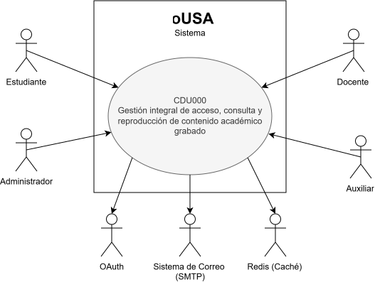

### Primera Descomposición por módulo
#### Módulo de Autenticación
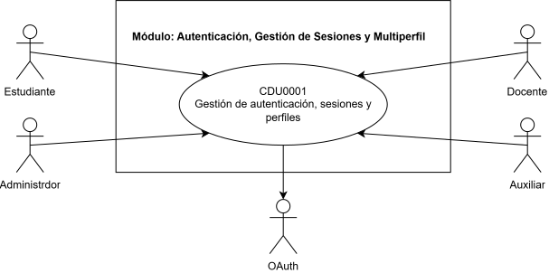

#### Módulo de Inscripciones
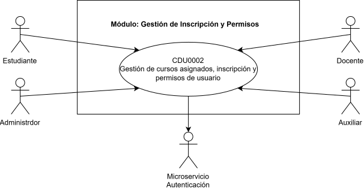

#### Módulo de Contenido
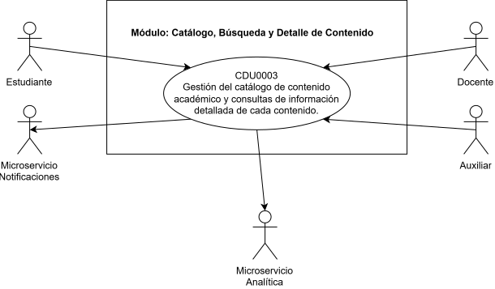

#### Módulo de Métricas
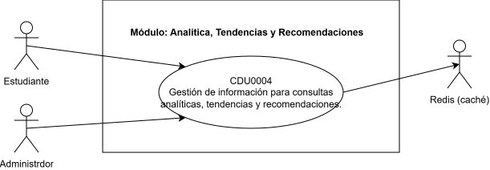

#### Módulo de Reproducción
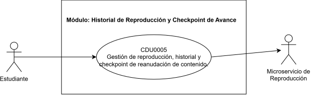

#### Módulo de Notificaciones
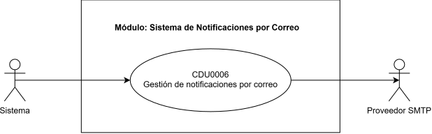

# Casos de uso expandidos
## Módulo 1: Autenticación, Gestión de Sesiones y Multiperfil

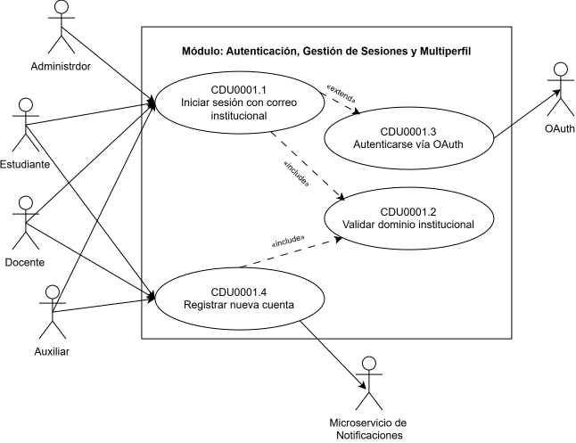
---
 
### CDU0001.1: Autenticar usuario institucional
 
| Campo | Descripción |
|-------|-------------|
| ID | CDU0001.1 |
| Nombre | Iniciar sesión con correo institucional |
| Actor | Estudiante, Docente, Auxiliar, Administrador |
| Descripción | Permite a usuarios con correo institucional autenticarse en la plataforma, estableciendo una sesión segura. |
| Precondiciones | El usuario ya debe tener una cuenta registrada. |
| Postcondiciones | El usuario tiene una sesión activa con su rol identificado. |
 
**Flujo principal:**
 
| Paso | Actor | Acción |
|------|-------|--------|
| 1 | Usuario | Accede a la pantalla de login. |
| 2 | Usuario | Ingresa correo institucional y contraseña. |
| 3 | Sistema | Validar que se tenga un dominio institucional. |
| 4 | Sistema | Valida las credenciales contra la base de datos. |
| 5 | Sistema | Genera un JWT y una Session Cookie. |
| 6 | Sistema | Redirige al usuario al catálogo principal según su rol. |
 
**Flujos alternativos:**
 
| ID | Condición | Acción |
|----|-----------|--------|
| FA-01 | El usuario elige ingresar con cuenta institucional usando el servicio OAuth | El sistema extiende hace la validación con el proveedor y se sigue el flujo principal desde el paso 5. |
 
**Flujos de excepción:**
 
| ID | Condición | Acción |
|----|-----------|--------|
| FE-01 | El correo no pertenece al dominio institucional | El sistema rechaza el intento y muestra "Correo no autorizado". |
| FE-02 | La contraseña no coincide | El sistema incrementa el contador de intentos fallidos y muestra "Credenciales incorrectas". |
 
---
 
### CDU0001.2: Validar dominio institucional
 
| Campo | Descripción |
|-------|-------------|
| ID | CDU0001.2 |
| Nombre | Validar dominio institucional |
| Actor | include |
| Descripción | Verifica que el correo ingresado pertenezca al dominio autorizado de la Facultad de Ingeniería. |
| Precondiciones | Se recibió un correo electrónico como parte de un login o registro. |
| Postcondiciones | Se confirma o rechaza la validez del dominio del correo. |
 
**Flujo principal:**
 
| Paso | Actor | Acción |
|------|-------|--------|
| 1 | Sistema | Recibe el correo electrónico a validar. |
| 2 | Sistema | Compara el dominio permitido con el ingresado. |
| 3 | Sistema | Retorna "dominio válido" al caso de uso que lo invocó. |
 
**Flujos alternativos:**
 
| ID | Condición | Acción |
|----|-----------|--------|
| - | - | - |
 
**Flujos de excepción:**
 
| ID | Condición | Acción |
|----|-----------|--------|
| FE-01 | El dominio no está autorizado | El sistema retorna "dominio inválido" y el caso de uso invocador aborta el flujo. |
 
---
 
### CDU0001.3: Autenticarse vía OAuth institucional
 
| Campo | Descripción |
|-------|-------------|
| ID | CDU0001.3 |
| Nombre | Autenticarse vía OAuth institucional |
| Actor | Estudiante, Docente, Auxiliar, Administrador, OAuth Institucional |
| Descripción | Ruta alternativa (extend) de autenticación delegando la verificación de identidad al proveedor OAuth institucional. |
| Precondiciones | El usuario cuenta con una identidad federada en el sistema OAuth de la universidad. |
| Postcondiciones | El usuario queda autenticado mediante identidad federada. |
 
**Flujo principal:**
 
| Paso | Actor | Acción |
|------|-------|--------|
| 1 | Usuario | Selecciona "Ingresar con cuenta institucional" en el login. |
| 2 | Sistema | Redirige al usuario al proveedor OAuth institucional. |
| 3 | Usuario | Se autentica en el proveedor OAuth. |
| 4 | OAuth Institucional | Retorna un token de identidad al sistema. |
| 5 | Sistema | Valida el token y continúa el flujo de principal desde su paso 5. |
 
**Flujos alternativos:**
 
| ID | Condición | Acción |
|----|-----------|--------|
| - | - | - |
 
**Flujos de excepción:**
 
| ID | Condición | Acción |
|----|-----------|--------|
| FE-01 | El usuario cancela o falla la autenticación en el proveedor | El sistema retorna al login mostrando "No se pudo completar el inicio de sesión". |
| FE-02 | El token recibido es inválido o expiró | El sistema rechaza el intento y solicita reintentar. |
 
---
 
### CDU0001.4: Registrar cuenta nueva
 
| Campo | Descripción |
|-------|-------------|
| ID | CDU0001.4 |
| Nombre | Registrar cuenta nueva |
| Actor | Estudiante, Docente/Catedrático, Auxiliar, Microservicio de Notificaciones |
| Descripción | Permite a un usuario con correo institucional crear su cuenta por primera vez en la plataforma. |
| Precondiciones | El usuario no tiene una cuenta previamente creada. |
| Postcondiciones | Se crea una nueva cuenta de usuario y se notifica por correo. |
 
**Flujo principal:**
 
| Paso | Actor | Acción |
|------|-------|--------|
| 1 | Usuario | Accede a la pantalla de registro. |
| 2 | Usuario | Ingresa su correo institucional y define una contraseña. |
| 3 | Sistema | Ejecuta CDU0001.2 (Validar dominio institucional). |
| 4 | Sistema | Crea el registro de usuario con rol por defecto (Estudiante). |
| 5 | Sistema | Dispara un evento hacia el Microservicio de Notificaciones para enviar el correo de confirmación de registro. |
| 6 | Sistema | Redirige al usuario al login. |
 
**Flujos alternativos:**
 
| ID | Condición | Acción |
|----|-----------|--------|
| - | - | - |
 
**Flujos de excepción:**
 
| ID | Condición | Acción |
|----|-----------|--------|
| FE-01 | El correo no pertenece al dominio institucional | El registro se rechaza mostrando "Correo no autorizado". |
| FE-02 | El correo ya está registrado | El sistema muestra "Ya existe una cuenta con este correo" y sugiere iniciar sesión. |
 
---
## Módulo 2: Gestión de Inscripción y Permisos
 
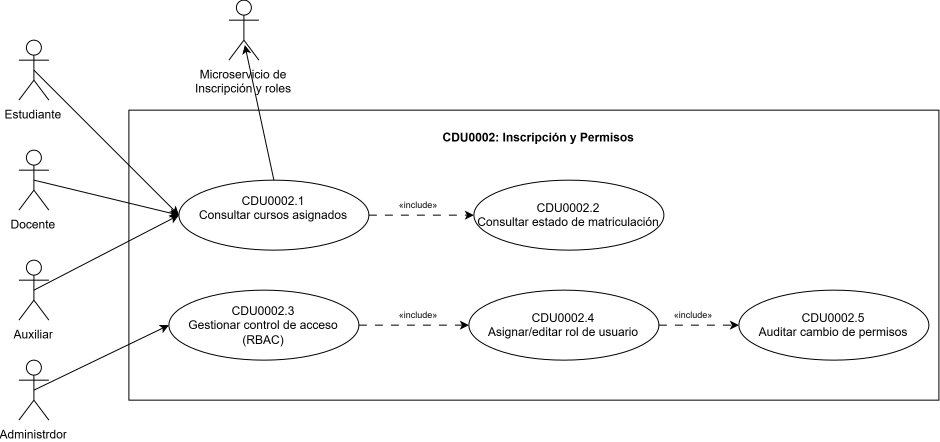
 
---
 
### CDU0002.1: Consultar cursos asignados/inscritos
 
| Campo | Descripción |
|-------|-------------|
| ID | CDU0002.1 |
| Nombre | Consultar cursos asignados/inscritos |
| Actor | Estudiante, Docente/Catedrático, Auxiliar |
| Descripción | Permite a cualquier usuario institucional consultar los cursos en los que está inscrito o asignado durante el semestre vigente. |
| Precondiciones | El usuario tiene una sesión activa. |
| Postcondiciones | Se muestra al usuario el listado de cursos correspondiente a su rol. |
 
Flujo principal:
 
| Paso | Actor | Acción |
|------|-------|--------|
| 1 | Usuario | Accede al panel de cursos/asignaciones. |
| 2 | Sistema | Identifica el rol del usuario mediante el Microservicio de Autenticación. |
| 3 | Sistema | Ejecuta consultar estado de matriculación. |
| 4 | Sistema | Muestra el listado de cursos según el rol. |
 
Flujos alternativos:
 
| ID | Condición | Acción |
|----|-----------|--------|
| - | - | - |
 
Flujos de excepción:
 
| ID | Condición | Acción |
|----|-----------|--------|
| FE-01 | El usuario no tiene cursos registrados para el semestre vigente | El sistema muestra "No hay cursos asociados a tu cuenta este semestre". |
| FE-02 | Error de comunicación con el Microservicio de Autenticación | El sistema muestra un mensaje de error genérico y solicita reintentar. |
 
---
 
### CDU0002.2: Consultar estado de matriculación
 
| Campo | Descripción |
|-------|-------------|
| ID | CDU0002.2 |
| Nombre | Consultar estado de matriculación |
| Actor | include |
| Descripción | Verifica y retorna el estado de matriculación vigente del usuario (activo, pendiente, cerrado). |
| Precondiciones | El usuario ya fue identificado por rol. |
| Postcondiciones | Se retorna el estado de matriculación al caso de uso que lo invocó. |
 
Flujo principal:
 
| Paso | Actor | Acción |
|------|-------|--------|
| 1 | Sistema | Consulta la base de datos de matriculación del usuario. |
| 2 | Sistema | Retorna el estado vigente. |
 
Flujos alternativos:
 
| ID | Condición | Acción |
|----|-----------|--------|
| — | Ninguno | — |
 
Flujos de excepción:
 
| ID | Condición | Acción |
|----|-----------|--------|
| FE-01 | No existe registro de matriculación | El sistema retorna "sin matrícula" al caso de uso invocador. |
 
---
 
### CDU0002.3: Gestionar control de acceso por roles (RBAC)
 
| Campo | Descripción |
|-------|-------------|
| ID | CDU0002.3 |
| Nombre | Gestionar control de acceso por roles (RBAC) |
| Actor | Administrador |
| Descripción | Permite al administrador visualizar y administrar los roles existentes en la plataforma (Estudiante, Docente/Catedrático, Auxiliar, Administrador). |
| Precondiciones | El administrador tiene una sesión activa. |
| Postcondiciones | El administrador puede ver y gestionar los roles del sistema. |
 
Flujo principal:
 
| Paso | Actor | Acción |
|------|-------|--------|
| 1 | Administrador | Accede al panel de gestión de roles. |
| 2 | Sistema | Muestra el listado de usuarios con su rol actual. |
| 3 | Administrador | Selecciona un usuario para modificar su rol. |
| 4 | Sistema | Ejecuta asignar/editar rol de usuario. |
 
Flujos alternativos:
 
| ID | Condición | Acción |
|----|-----------|--------|
| - | - | - |
 
Flujos de excepción:
 
| ID | Condición | Acción |
|----|-----------|--------|
| FE-01 | El administrador no tiene permisos suficientes | El sistema muestra "Acceso denegado". |
 
---
 
### CDU0002.4: Asignar/editar rol de usuario
 
| Campo | Descripción |
|-------|-------------|
| ID | CDU0002.4 |
| Nombre | Asignar/editar rol de usuario |
| Actor | Administrador |
| Descripción | Permite modificar el rol asignado a un usuario específico dentro del sistema. |
| Precondiciones | El usuario a modificar existe en el sistema. |
| Postcondiciones | El rol del usuario queda actualizado. |
 
Flujo principal:
 
| Paso | Actor | Acción |
|------|-------|--------|
| 1 | Administrador | Selecciona el nuevo rol para el usuario. |
| 2 | Sistema | Actualiza el rol del usuario en la base de datos. |
| 3 | Sistema | Ejecuta auditar cambio de permisos. |
| 4 | Sistema | Confirma el cambio al administrador. |
 
Flujos alternativos:
 
| ID | Condición | Acción |
|----|-----------|--------|
| - | - | - |
 
Flujos de excepción:
 
| ID | Condición | Acción |
|----|-----------|--------|
| FE-01 | El rol seleccionado no es válido | El sistema rechaza el cambio y muestra "Rol inválido". |
 
---
 
### CDU0002.5: Auditar cambio de permisos
 
| Campo | Descripción |
|-------|-------------|
| ID | CDU0002.5 |
| Nombre | Auditar cambio de permisos |
| Actor | ejecutado automáticamente como trigger de base de datos |
| Descripción | Registra en la bitácora de auditoría cada cambio de rol/permiso realizado sobre un usuario. |
| Precondiciones | Se realizó un cambio de rol. |
| Postcondiciones | Queda un registro de auditoría del cambio. |
 
Flujo principal:
 
| Paso | Actor | Acción |
|------|-------|--------|
| 1 | Sistema (trigger) | Detecta el cambio de rol en la base de datos. |
| 2 | Sistema (trigger) | Inserta un registro de auditoría con el detalle del cambio. |
 
Flujos alternativos:
 
| ID | Condición | Acción |
|----|-----------|--------|
| - | - | - |
 
Flujos de excepción:
 
| ID | Condición | Acción |
|----|-----------|--------|
| FE-01 | Falla la escritura del registro de auditoría | El sistema revierte el cambio de rol y notifica el error al administrador. |
 
---
## Módulo 3: Catálogo, Búsqueda y Detalle de Contenido

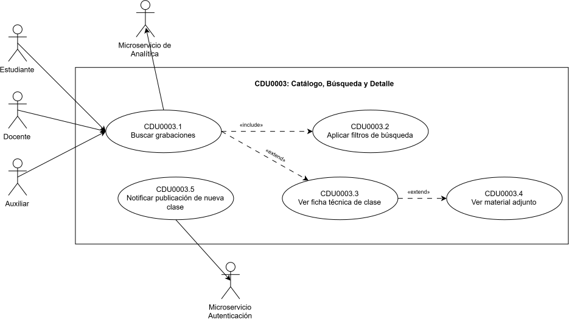
---
 
### CDU0003.1: Buscar grabaciones
 
| Campo | Descripción |
|-------|-------------|
| ID | CDU0003.1 |
| Nombre | Buscar grabaciones |
| Actor | Estudiante, Docente, Auxiliar |
| Descripción | Permite a cualquier usuario institucional buscar grabaciones de clases dentro del catálogo académico. |
| Precondiciones | El usuario tiene una sesión activa. |
| Postcondiciones | Se muestra al usuario el listado de grabaciones que coinciden con la búsqueda. |
 
Flujo principal:
 
| Paso | Actor | Acción |
|------|-------|--------|
| 1 | Usuario | Accede al catálogo de grabaciones. |
| 2 | Usuario | Ingresa un término de búsqueda o abre el panel de filtros. |
| 3 | Sistema | Ejecuta aplicar filtros de búsqueda. |
| 4 | Sistema | Muestra el listado de resultados. |
 
Flujos alternativos:
 
| ID | Condición | Acción |
|----|-----------|--------|
| FA-01 | El usuario selecciona un resultado del listado | El sistema extiende hacia ver ficha técnica de clase. |
 
Flujos de excepción:
 
| ID | Condición | Acción |
|----|-----------|--------|
| FE-01 | No hay resultados que coincidan con la búsqueda | El sistema muestra "No se encontraron grabaciones para tu búsqueda". |
| FE-02 | Error de comunicación con el catálogo | El sistema muestra un mensaje de error genérico y solicita reintentar. |
 
---
 
### CDU0003.2: Aplicar filtros de búsqueda
 
| Campo | Descripción |
|-------|-------------|
| ID | CDU0003.2 |
| Nombre | Aplicar filtros de búsqueda |
| Actor | include |
| Descripción | Filtra las grabaciones del catálogo por semestre/año, escuela/área, curso, catedrático y tema/etiqueta. |
| Precondiciones | Se recibió un criterio de búsqueda o filtro. |
| Postcondiciones | Se retorna el subconjunto de grabaciones que cumple los filtros. |
 
Flujo principal:
 
| Paso | Actor | Acción |
|------|-------|--------|
| 1 | Sistema | Recibe los criterios de filtro seleccionados. |
| 2 | Sistema | Consulta la base de datos del catálogo aplicando los filtros. |
| 3 | Sistema | Retorna el listado filtrado al caso de uso invocador. |
 
Flujos alternativos:
 
| ID | Condición | Acción |
|----|-----------|--------|
| - | - | - |
 
Flujos de excepción:
 
| ID | Condición | Acción |
|----|-----------|--------|
| FE-01 | Combinación de filtros inválida  | El sistema ignora el filtro inválido y aplica el resto. |
 
---
 
### CDU0003.3: Ver ficha técnica de clase
 
| Campo | Descripción |
|-------|-------------|
| ID | CDU0003.3 |
| Nombre | Ver ficha técnica de clase |
| Actor | Estudiante, Docente, Auxiliar |
| Descripción | Muestra el detalle de una grabación: unidad del programa, fecha de impartición, catedráticos/auxiliares participantes. |
| Precondiciones | El usuario seleccionó una grabación. |
| Postcondiciones | Se muestra la ficha técnica completa de la clase. |
 
Flujo principal:
 
| Paso | Actor | Acción |
|------|-------|--------|
| 1 | Usuario | Selecciona una grabación del listado de resultados. |
| 2 | Sistema | Consulta los datos de la ficha técnica de la clase. |
| 3 | Sistema | Muestra la ficha técnica al usuario. |
 
Flujos alternativos:
 
| ID | Condición | Acción |
|----|-----------|--------|
| FA-01 | La clase tiene material adjunto | El sistema extiende hacia ver material adjunto. |
 
Flujos de excepción:
 
| ID | Condición | Acción |
|----|-----------|--------|
| FE-01 | La grabación ya no está disponible | El sistema muestra "Esta grabación ya no se encuentra disponible". |
 
---
 
### CDU0003.4: Ver material adjunto
 
| Campo | Descripción |
|-------|-------------|
| ID | CDU0003.4 |
| Nombre | Ver material adjunto |
| Actor | Estudiante, Docente, Auxiliar |
| Descripción | Permite consultar y descargar el material adjunto asociado a una clase grabada. |
| Precondiciones | La ficha técnica de la clase tiene material adjunto disponible. |
| Postcondiciones | El usuario visualiza o descarga el material adjunto. |
 
Flujo principal:
 
| Paso | Actor | Acción |
|------|-------|--------|
| 1 | Usuario | Selecciona el material adjunto desde la ficha técnica. |
| 2 | Sistema | Recupera el archivo asociado. |
| 3 | Sistema | Muestra o descarga el archivo al usuario. |
 
Flujos alternativos:
 
| ID | Condición | Acción |
|----|-----------|--------|
| - | - | - |
 
Flujos de excepción:
 
| ID | Condición | Acción |
|----|-----------|--------|
| FE-01 | El archivo no se pudo recuperar | El sistema muestra "No se pudo cargar el material adjunto". |
 
---
 
### CDU0003.5: Notificar publicación de nueva clase
 
| Campo | Descripción |
|-------|-------------|
| ID | CDU0003.5 |
| Nombre | Notificar publicación de nueva clase |
| Actor | Microservicio de Notificaciones |
| Descripción | Cuando se agrega una nueva grabación al catálogo, dispara un evento hacia el Microservicio de Notificaciones para avisar a los estudiantes inscritos en el curso correspondiente. |
| Precondiciones | Se publicó una nueva grabación en el catálogo. |
| Postcondiciones | Los estudiantes inscritos reciben la notificación de la nueva clase disponible. |
 
Flujo principal:
 
| Paso | Actor | Acción |
|------|-------|--------|
| 1 | Sistema | Detecta la publicación de una nueva grabación en el catálogo. |
| 2 | Sistema | Identifica a los estudiantes inscritos en el curso correspondiente. |
| 3 | Sistema | Dispara el evento hacia el Microservicio de Notificaciones. |
 
Flujos alternativos:
 
| ID | Condición | Acción |
|----|-----------|--------|
| - | - | - |
 
Flujos de excepción:
 
| ID | Condición | Acción |
|----|-----------|--------|
| FE-01 | Falla la comunicación con el Microservicio de Notificaciones | El sistema registra el evento en una cola de reintentos. |
 
---

## Módulo 4: Analítica, Tendencias y Recomendaciones
 
 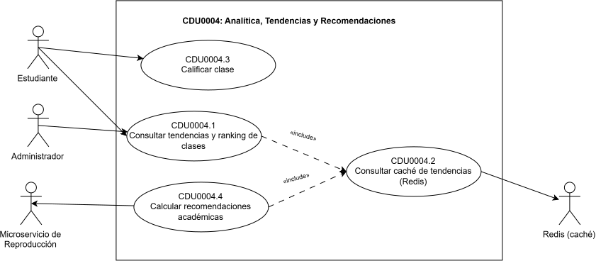

---
 
| Campo | Descripción |
|-------|-------------|
| ID | CDU0004.1 |
| Nombre | Consultar tendencias y ranking de clases |
| Actor | Estudiante, Administrador |
| Descripción | Permite consultar las clases más vistas por semana, los temas de mayor tendencia y el ranking de clases mejor valoradas. |
| Precondiciones | El usuario tiene una sesión activa. |
| Postcondiciones | Se muestra al usuario el listado de tendencias y ranking vigente. |
 
Flujo principal:
 
| Paso | Actor | Acción |
|------|-------|--------|
| 1 | Usuario | Accede a la sección de tendencias. |
| 2 | Sistema | Ejecuta consultar caché de tendencias (Redis). |
| 3 | Sistema | Muestra el ranking y las tendencias vigentes. |
 
Flujos alternativos:
 
| ID | Condición | Acción |
|----|-----------|--------|
| - | - | - |
 
Flujos de excepción:
 
| ID | Condición | Acción |
|----|-----------|--------|
| FE-01 | La caché no tiene datos vigentes  | El sistema recalcula las tendencias desde la base de datos y actualiza la caché. |
| FE-02 | Error de comunicación con Redis | El sistema muestra un mensaje de error genérico y solicita reintentar. |
 
---
 
| Campo | Descripción |
|-------|-------------|
| ID | CDU0004.2 |
| Nombre | Consultar caché de tendencias (Redis) |
| Actor | include |
| Descripción | Recupera desde Redis las consultas frecuentes de catálogo y tendencias, evitando sobrecargar la base de datos. |
| Precondiciones | Se solicitó una consulta de tendencias o recomendaciones. |
| Postcondiciones | Se retorna el dato solicitado desde la caché o se señala que expiró. |
 
Flujo principal:
 
| Paso | Actor | Acción |
|------|-------|--------|
| 1 | Sistema | Consulta la clave correspondiente en Redis. |
| 2 | Sistema | Retorna el valor cacheado al caso de uso invocador. |
 
Flujos alternativos:
 
| ID | Condición | Acción |
|----|-----------|--------|
| - | - | - |
 
Flujos de excepción:
 
| ID | Condición | Acción |
|----|-----------|--------|
| FE-01 | La clave no existe o expiró| El sistema retorna "caché vacía" al caso de uso invocador. |
 
---
 
| Campo | Descripción |
|-------|-------------|
| ID | CDU0004.3 |
| Nombre | Calificar clase |
| Actor | Estudiante |
| Descripción | Permite a un estudiante calificar una clase vista, alimentando el cálculo dinámico del ranking y las recomendaciones. |
| Precondiciones | El estudiante consultó la ficha técnica de la clase. |
| Postcondiciones | Se registra la calificación y se actualiza el porcentaje de recomendación de la clase. |
 
Flujo principal:
 
| Paso | Actor | Acción |
|------|-------|--------|
| 1 | Usuario | Selecciona una puntuación desde la ficha técnica de la clase. |
| 2 | Sistema | Registra la calificación en la base de datos. |
| 3 | Sistema | Recalcula el porcentaje de recomendación de la clase. |
 
Flujos alternativos:
 
| ID | Condición | Acción |
|----|-----------|--------|
| FA-01 | El estudiante ya había calificado la clase | El sistema actualiza la calificación previa en lugar de crear una nueva. |
 
Flujos de excepción:
 
| ID | Condición | Acción |
|----|-----------|--------|
| FE-01 | Error al registrar la calificación | El sistema muestra un mensaje de error genérico y solicita reintentar. |
 
---
 
| Campo | Descripción |
|-------|-------------|
| ID | CDU0004.4 |
| Nombre | Calcular recomendaciones académicas |
| Actor | Microservicio de Reproducción |
| Descripción | Calcula dinámicamente un porcentaje de recomendación para cada clase, a partir del historial de reproducción y las calificaciones registradas. |
| Precondiciones | Existen datos de reproducción y/o calificaciones disponibles. |
| Postcondiciones | Se actualiza el porcentaje de recomendación de las clases procesadas. |
 
Flujo principal:
 
| Paso | Actor | Acción |
|------|-------|--------|
| 1 | Sistema | Recibe los datos de reproducción/checkpoint desde el microservicio de historial. |
| 2 | Sistema | Ejecuta consultar caché de tendencias (Redis). |
| 3 | Sistema | Calcula el porcentaje de recomendación de cada clase. |
| 4 | Sistema | Actualiza los resultados en la base de datos y en la caché. |
 
Flujos alternativos:
 
| ID | Condición | Acción |
|----|-----------|--------|
| - | - | - |
 
Flujos de excepción:
 
| ID | Condición | Acción |
|----|-----------|--------|
| FE-01 | No hay suficientes datos históricos para calcular la recomendación | El sistema asigna un valor por defecto y marca la clase como "sin suficiente información". |
 
---

## Módulo 5: Historial de Reproducción y Checkpoint de Avance
 
 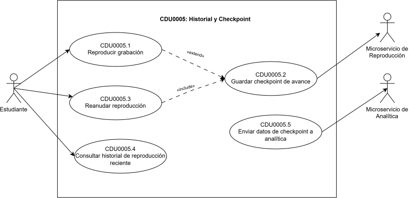
 
---
 
| Campo | Descripción |
|-------|-------------|
| ID | CDU0005.1 |
| Nombre | Reproducir grabación |
| Actor | Estudiante |
| Descripción | Permite al estudiante reproducir el video de una clase grabada. |
| Precondiciones | El estudiante tiene una sesión activa. |
| Postcondiciones | El video se reproduce y el sistema comienza a registrar el avance. |
 
Flujo principal:
 
| Paso | Actor | Acción |
|------|-------|--------|
| 1 | Usuario | Selecciona una grabación desde su ficha técnica. |
| 2 | Sistema | Carga el video y comienza la reproducción. |
| 3 | Sistema | Registra periódicamente el minuto exacto de avance. |
 
Flujos alternativos:
 
| ID | Condición | Acción |
|----|-----------|--------|
| FA-01 | El estudiante pausa o cierra el video antes de terminar | El sistema extiende hacia guardar checkpoint de avance. |
 
Flujos de excepción:
 
| ID | Condición | Acción |
|----|-----------|--------|
| FE-01 | El video no se puede cargar | El sistema muestra "No se pudo cargar la grabación" y solicita reintentar. |
 
---
 
| Campo | Descripción |
|-------|-------------|
| ID | CDU0005.2 |
| Nombre | Guardar checkpoint de avance |
| Actor | include |
| Descripción | Almacena con precisión el semestre, curso, unidad, tema y segundo/minuto exacto donde el estudiante detuvo la reproducción. |
| Precondiciones | El estudiante estaba reproduciendo una grabación. |
| Postcondiciones | Queda registrado el punto exacto de avance para esa clase y ese estudiante. |
 
Flujo principal:
 
| Paso | Actor | Acción |
|------|-------|--------|
| 1 | Sistema | Captura el punto exacto de reproducción. |
| 2 | Sistema | Almacena o actualiza el checkpoint asociado a la cuenta del estudiante. |
 
Flujos alternativos:
 
| ID | Condición | Acción |
|----|-----------|--------|
| - | - | - |
 
Flujos de excepción:
 
| ID | Condición | Acción |
|----|-----------|--------|
| FE-01 | Falla el guardado del checkpoint | El sistema reintenta en segundo plano sin interrumpir al usuario. |
 
---
 
| Campo | Descripción |
|-------|-------------|
| ID | CDU0005.3 |
| Nombre | Reanudar reproducción |
| Actor | Estudiante |
| Descripción | Permite al estudiante continuar viendo una clase exactamente desde el punto donde la dejó. |
| Precondiciones | Existe un checkpoint previo guardado para esa clase y ese estudiante. |
| Postcondiciones | El video se reanuda desde el minuto exacto del checkpoint. |
 
Flujo principal:
 
| Paso | Actor | Acción |
|------|-------|--------|
| 1 | Usuario | Selecciona una clase que ya había visto parcialmente. |
| 2 | Sistema | Ejecuta guardar checkpoint de avance para recuperar el último punto guardado. |
| 3 | Sistema | Reanuda la reproducción desde ese punto. |
 
Flujos alternativos:
 
| ID | Condición | Acción |
|----|-----------|--------|
| - | - | - |
 
Flujos de excepción:
 
| ID | Condición | Acción |
|----|-----------|--------|
| FE-01 | No existe checkpoint previo para esa clase | El sistema inicia la reproducción desde el minuto 0. |
 
---
 
| Campo | Descripción |
|-------|-------------|
| ID | CDU0005.4 |
| Nombre | Consultar historial de reproducción reciente |
| Actor | Estudiante |
| Descripción | Muestra al estudiante el listado de clases vistas recientemente y su avance en cada una. |
| Precondiciones | El estudiante tiene una sesión activa. |
| Postcondiciones | Se muestra el historial reciente con el progreso de cada clase. |
 
Flujo principal:
 
| Paso | Actor | Acción |
|------|-------|--------|
| 1 | Usuario | Accede a la sección de historial reciente. |
| 2 | Sistema | Consulta los checkpoints más recientes del estudiante. |
| 3 | Sistema | Muestra el listado con el porcentaje de avance de cada clase. |
 
Flujos alternativos:
 
| ID | Condición | Acción |
|----|-----------|--------|
| - | - | - |
 
Flujos de excepción:
 
| ID | Condición | Acción |
|----|-----------|--------|
| FE-01 | El estudiante no tiene historial reciente | El sistema muestra "Aún no has visto ninguna clase". |
 
---
 
| Campo | Descripción |
|-------|-------------|
| ID | CDU0005.5 |
| Nombre | Enviar datos de checkpoint a analítica |
| Actor | Microservicio de Analítica |
| Descripción | Envía de forma periódica los datos de reproducción y checkpoints hacia el módulo de Analítica para el cálculo de tendencias y recomendaciones. |
| Precondiciones | Existen checkpoints nuevos o actualizados desde la última sincronización. |
| Postcondiciones | El Microservicio de Analítica recibe los datos actualizados de reproducción. |
 
Flujo principal:
 
| Paso | Actor | Acción |
|------|-------|--------|
| 1 | Sistema | Identifica los checkpoints nuevos o actualizados. |
| 2 | Sistema | Envía el lote de datos hacia el Microservicio de Analítica. |
 
Flujos alternativos:
 
| ID | Condición | Acción |
|----|-----------|--------|
| - | - | - |
 
Flujos de excepción:
 
| ID | Condición | Acción |
|----|-----------|--------|
| FE-01 | Falla la comunicación con el Microservicio de Analítica | El sistema encola el envío para reintentarlo más tarde. |
 
---

## Módulo 6: Sistema de Notificaciones por Correo
 
  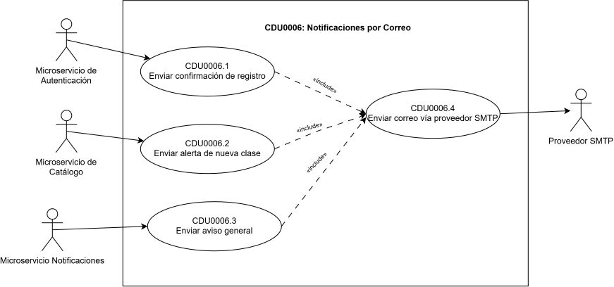

---
 
| Campo | Descripción |
|-------|-------------|
| ID | CDU0006.1 |
| Nombre | Enviar confirmación de registro |
| Actor | Microservicio de Autenticación |
| Descripción | Envía un correo de confirmación cuando un usuario completa su registro en la plataforma. |
| Precondiciones | Se creó una cuenta nueva. |
| Postcondiciones | El usuario recibe el correo de confirmación de registro. |
 
Flujo principal:
 
| Paso | Actor | Acción |
|------|-------|--------|
| 1 | Sistema | Recibe el evento de registro exitoso. |
| 2 | Sistema | Genera el contenido del correo de confirmación. |
| 3 | Sistema | Ejecuta enviar correo vía proveedor SMTP. |
 
Flujos alternativos:
 
| ID | Condición | Acción |
|----|-----------|--------|
| - | - | - |
 
Flujos de excepción:
 
| ID | Condición | Acción |
|----|-----------|--------|
| FE-01 | El evento de registro llega incompleto  | El sistema descarta la notificación y registra el error. |
 
---
 
| Campo | Descripción |
|-------|-------------|
| ID | CDU0006.2 |
| Nombre | Enviar alerta de nueva clase publicada |
| Actor | Microservicio de Catálogo |
| Descripción | Notifica a los estudiantes inscritos en un curso cuando se publica una nueva grabación de clase. |
| Precondiciones | Se publicó una grabación nueva en el catálogo. |
| Postcondiciones | Los estudiantes inscritos reciben el correo de alerta. |
 
Flujo principal:
 
| Paso | Actor | Acción |
|------|-------|--------|
| 1 | Sistema | Recibe el evento de publicación de nueva clase. |
| 2 | Sistema | Genera el contenido del correo de alerta con los datos de la clase. |
| 3 | Sistema | Ejecuta enviar correo vía proveedor SMTP para cada destinatario. |
 
Flujos alternativos:
 
| ID | Condición | Acción |
|----|-----------|--------|
| - | - | - |
 
Flujos de excepción:
 
| ID | Condición | Acción |
|----|-----------|--------|
| FE-01 | No hay estudiantes inscritos en el curso | El sistema descarta el envío sin generar correos. |
 
---
 
| Campo | Descripción |
|-------|-------------|
| ID | CDU0006.3 |
| Nombre | Enviar aviso general del sistema |
| Actor | Administrador |
| Descripción | Permite al administrador enviar un aviso general a todos los usuarios o a un grupo específico. |
| Precondiciones | El administrador tiene una sesión activa. |
| Postcondiciones | Los destinatarios seleccionados reciben el correo de aviso. |
 
Flujo principal:
 
| Paso | Actor | Acción |
|------|-------|--------|
| 1 | Administrador | Redacta el aviso y selecciona los destinatarios. |
| 2 | Sistema | Genera el contenido del correo de aviso. |
| 3 | Sistema | Ejecuta enviar correo vía proveedor SMTP para cada destinatario. |
 
Flujos alternativos:
 
| ID | Condición | Acción |
|----|-----------|--------|
| - | - | - |
 
Flujos de excepción:
 
| ID | Condición | Acción |
|----|-----------|--------|
| FE-01 | No se seleccionó ningún destinatario | El sistema rechaza el envío y muestra "Selecciona al menos un destinatario". |
 
---
 
| Campo | Descripción |
|-------|-------------|
| ID | CDU0006.4 |
| Nombre | Enviar correo vía proveedor SMTP |
| Actor | Proveedor SMTP |
| Descripción | Envía el correo electrónico ya generado hacia el destinatario final utilizando el proveedor SMTP configurado. |
| Precondiciones | Existe un contenido de correo listo para enviar. |
| Postcondiciones | El correo queda enviado. |
 
Flujo principal:
 
| Paso | Actor | Acción |
|------|-------|--------|
| 1 | Sistema | Envía la solicitud al proveedor SMTP. |
| 2 | Proveedor SMTP | Entrega el correo al destinatario. |
| 3 | Sistema | Registra el envío como exitoso. |
 
Flujos alternativos:
 
| ID | Condición | Acción |
|----|-----------|--------|
| - | - | - |
 
Flujos de excepción:
 
| ID | Condición | Acción |
|----|-----------|--------|
| FE-01 | El proveedor SMTP no responde o rechaza el envío | El sistema encola el correo para reintento posterior. |
 
---

## Vista de Arquitectura (Modelo 4+1)

 
### Vista de Escenarios
Describe los casos de uso o situaciones en las que interactúan los usuarios con el sistema. Sirve para validar que la arquitectura cubra los requisitos funcionales.

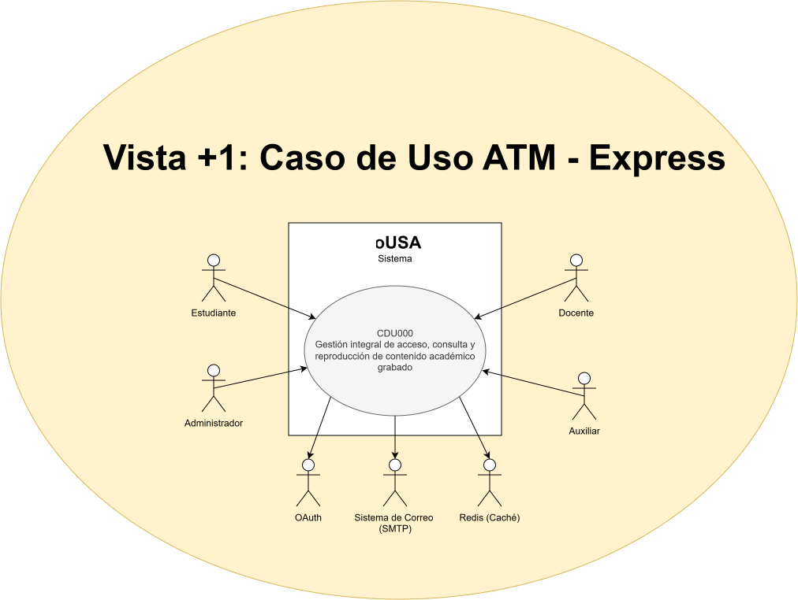

### Vista Lógica
Muestra la estructura funcional del sistema, es decir, las clases, módulos, servicios o entidades y cómo se relacionan entre sí para implementar la lógica del negocio.

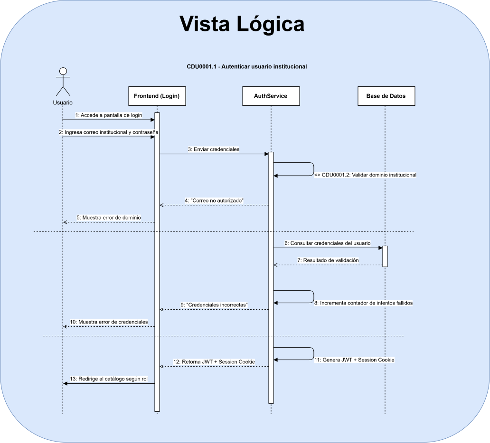

### Vista de Procesos 
Representa cómo se comunican y coordinan los procesos o servicios del sistema durante la ejecución. Esta vista muestra las llamadas remotas entre servicios, el intercambio de datos y la concurrencia.

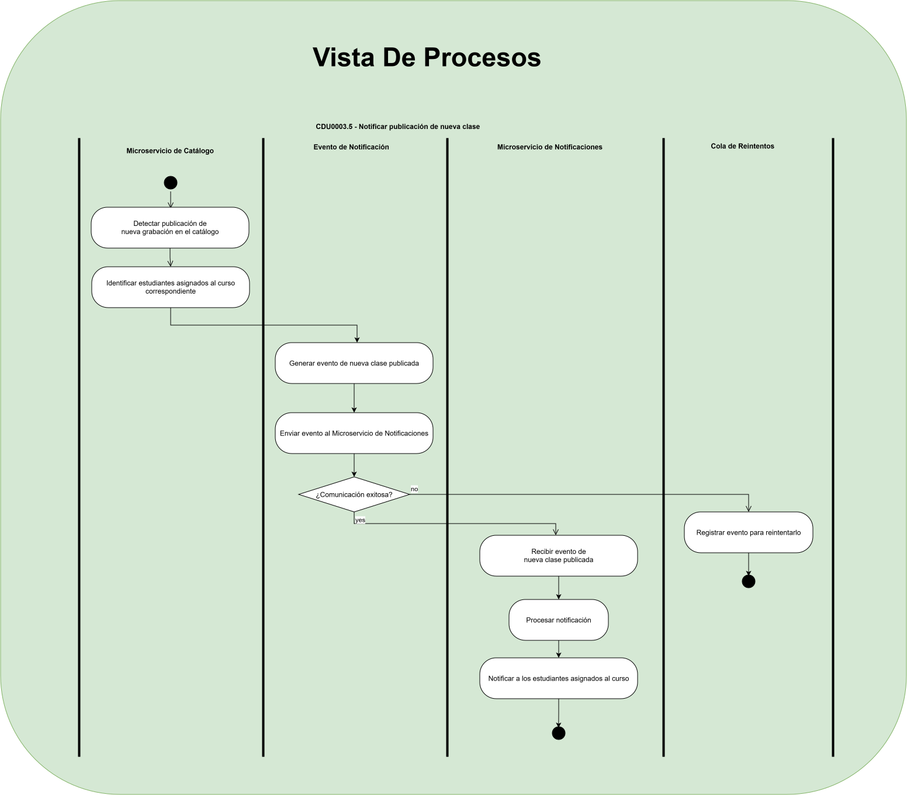

### Vista de Componentes
Describe la organización del software en componentes o módulos, mostrando cómo se divide el sistema, sus dependencias y la función de cada parte.

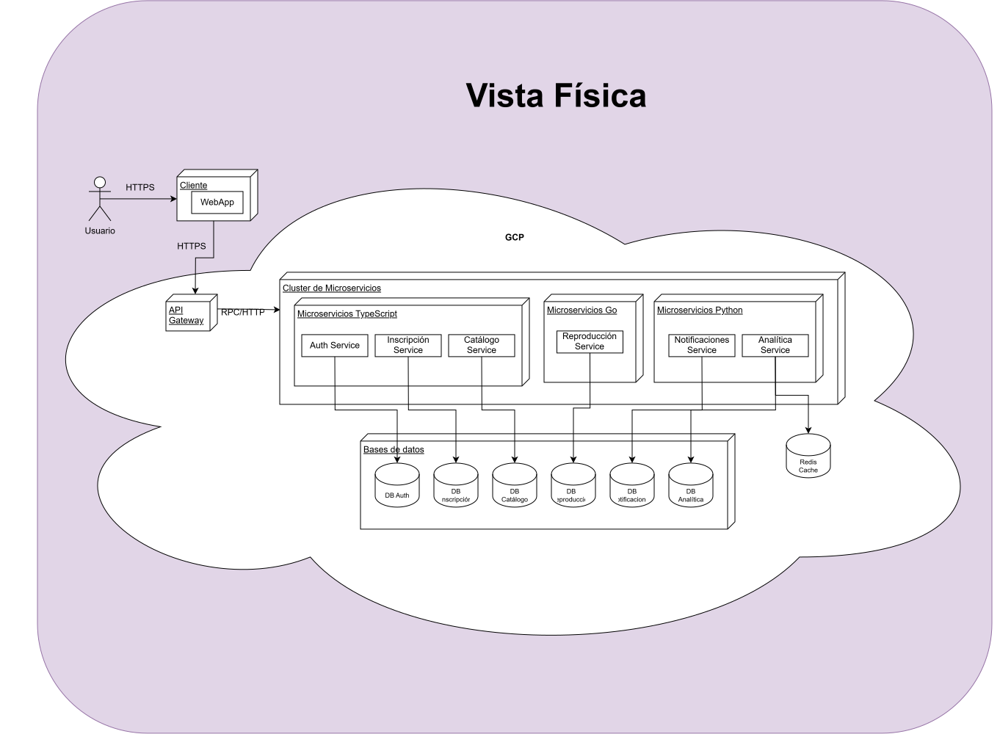

### Vista de Despliegue
Explica cómo se distribuye el sistema en la infraestructura física o virtual, indicando servidores, contenedores, dispositivos, redes y dónde se ejecuta cada componente.

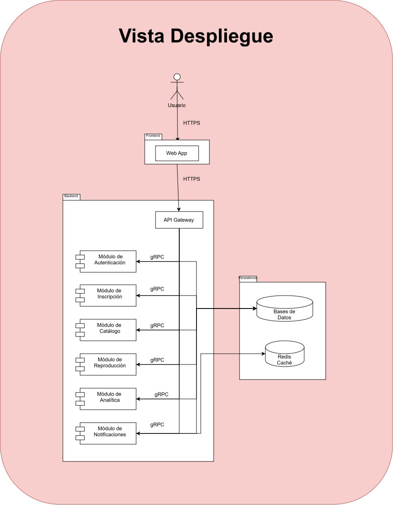

## Diseño del Modelado de Datos (DER)

### Auth Service
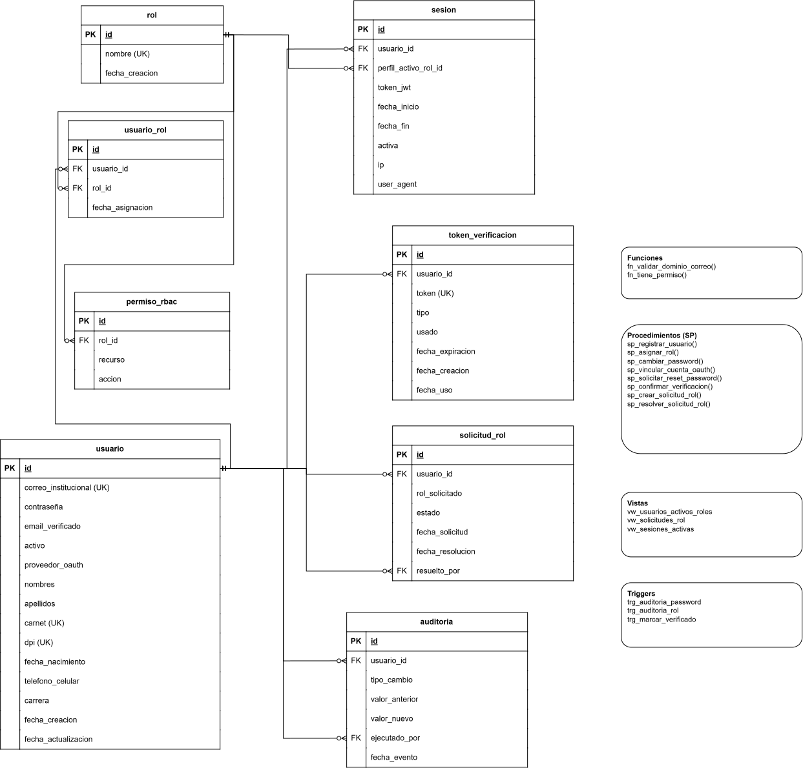

### Objetos programables
| Tipo | Nombre | Descripción |
|---|---|---|
| SP | sp_registrar_usuario | Valida el dominio institucional (llama a fn_validar_dominio_correo) e inserta el usuario junto con su rol por defecto (Estudiante). |
| SP | sp_asignar_rol | Agrega un nuevo perfil/rol a un usuario existente (soporta multiperfil). |
| SP | sp_cambiar_password | Actualiza credenciales dentro de una transacción; dispara el trigger de auditoría. |
| SP | sp_vincular_cuenta_oauth | Vincula un proveedor OAuth institucional a un usuario existente (o lo crea si no existe). |
| SP | sp_solicitar_reset_password | Genera un token_verificacion de tipo RESET_PASSWORD con fecha de expiración. |
| SP | sp_confirmar_verificacion | Valida un token (VERIFICACION_CORREO o RESET_PASSWORD), lo marca como usado y aplica el efecto correspondiente. |
| Vista | vw_usuarios_activos_roles | Usuarios activos con el listado agregado de todos sus roles/perfiles disponibles. |
| Vista | vw_sesiones_activas | Sesiones vigentes (no expiradas) por usuario, usadas por el API Gateway para validación rápida. |
| Función | fn_validar_dominio_correo(correo) | Valida que el correo pertenezca a @ingenieria.usac.edu.gt o @ing.usac.edu.gt. |
| Función | fn_tiene_permiso(rol_id, recurso, accion) | Evalúa la matriz RBAC contra permiso_rbac. |
| Trigger | trg_auditoria_password | AFTER UPDATE OF hash_password ON usuario → inserta un registro en auditoria_credenciales. |
| Trigger | trg_auditoria_rol | AFTER INSERT OR DELETE ON usuario_rol → registra cambios de permisos/roles en auditoria_credenciales. |
| Trigger | trg_marcar_verificado | AFTER UPDATE OF usado ON token_verificacion (tipo VERIFICACION_CORREO) → marca usuario.email_verificado = true. |

### Inscripción Service

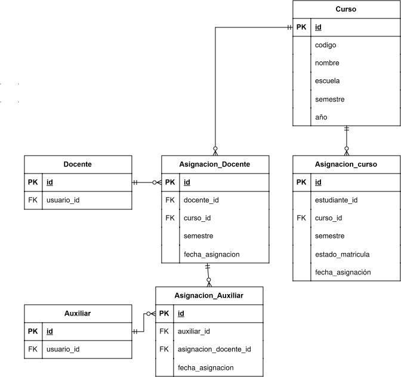

### Objetos programables
 
| Tipo | Nombre | Descripción |
|---|---|---|
| SP | sp_inscribir_estudiante | Valida cupo/duplicidad e inserta la inscripción con estado inicial PENDIENTE. |
| SP | sp_asignar_catedratico_curso | Asigna un catedrático como titular de un curso. |
| SP | sp_asignar_auxiliar_catedratico | Vincula un auxiliar a un catedrático específico (no directamente al curso). |
| Vista | vw_panel_estudiante | Cursos inscritos, estado de matrícula y catedrático asignado, por estudiante. |
| Vista | vw_cursos_por_catedratico | Cursos asignados junto con los auxiliares que apoyan a cada catedrático. |
| Función | fn_estado_matricula(estudiante_id_ref, curso_id) | Calcula el estado vigente de matrícula (ACTIVA, PENDIENTE, RETIRADA). |
| Trigger | trg_auditoria_inscripcion | AFTER UPDATE OF estado_matricula ON inscripcion → registra el cambio de estado en una tabla de auditoría local. |
| Trigger | trg_validar_auxiliar_unico_catedratico | BEFORE INSERT ON asignacion_auxiliar → evita asignaciones duplicadas del mismo auxiliar al mismo catedrático. |

### Catálogo Service

### Objetos programables
 
| Tipo | Nombre | Descripción |
|---|---|---|
| SP | sp_publicar_clase | Inserta la clase y dispara el trigger de evento de publicación. |
| SP | sp_asociar_etiquetas | Inserta múltiples relaciones clase_etiqueta en una sola transacción. |
| Vista | vw_ficha_tecnica_clase | Combina clase_grabada, curso_catalogo, docente_clase y clase_etiqueta en una sola proyección lista para el frontend. |
| Vista | vw_catalogo_por_semestre | Listado de clases agrupado por semestre/año/escuela. |
| Función | fn_buscar_clases | Búsqueda avanzada con filtros opcionales combinables (semestre, escuela, curso, catedrático, tema). |
| Trigger | trg_evento_clase_publicada | AFTER INSERT ON clase_grabada → inserta un registro en evento_publicacion_pendiente, consumido por el Notificaciones Service vía gRPC. |

### Reproducción Service

### Analítica Service

### Notificaciones Service

